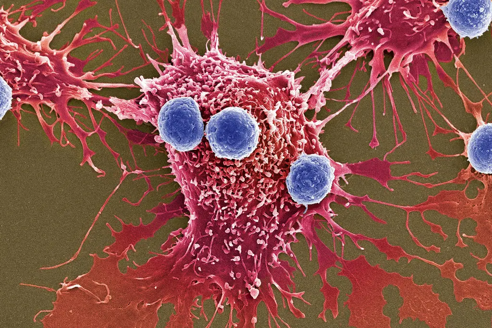

### 1、机器学习概述

#### 1.1、什么是机器学习

**机器学习**（Machine Learning）是**人工智能**（Artificial Intelligence）领域的一个子集，它主要关注如何让计算机系统通过**经验学习**（数据）并**自动**改进性能。机器学习算法可以让计算机从数据中学习**模式和规律**，而无需显式编程。这些算法能够根据输入数据**不断改进自身**，以便在新数据上做出**更好**的**预测或决策**。 

#### 1.2、机器学习的应用

机器学习可以应用于多个领域，解决各种问题，以下是一些常见的应用：

1. **预测和分析**：例如预测股票价格、房价、销售额等。
2. **图像识别**：例如车牌识别、人脸识别和目标检测。
3. **自然语言处理**：例如机器翻译、情感分析、语音识别和自动生成文本摘要。
4. **推荐系统**：例如为用户推荐电影、音乐或商品。
5. **游戏AI**：例如为电子游戏设计更具挑战性和逼真的对手。
6. **医疗诊断**：例如预测疾病风险、辅助诊断和制定治疗计划。
7. **金融风险评估**：例如信用评分、欺诈检测和保险定价。
8. **自动驾驶**：例如环境感知、路径规划和决策。
9. **无人机技术**：例如自主导航、目标检测和避障。
10. **机器人技术**：例如自主行走、抓取物体和与人互动。


**等等等等 ……**


#### 1.3、机器学习的前景

机器学习作为人工智能的核心技术，在近年来得到了迅速发展，为人类社会各个方面带来了巨大的影响和潜力。，机器学习将在很多领域发挥重要作用，为人类创造**更美好的生活**。 

1. **智能化生活**：随着机器学习技术的发展，人们的日常生活将变得更加便捷和智能。无论是家居、医疗、交通还是购物，机器学习都将为我们提供更加个性化和高效的服务。
2. **产业革新**：机器学习将推动各行各业的技术革新，使得传统产业实现数字化、智能化转型。这将有助于提高生产效率，降低成本，提高产品质量和创新能力。
3. **科学研究**：在科学研究领域，机器学习将协助人类挖掘更多知识，加速科学发现的速度。无论是在基础科学还是应用科学，机器学习都将发挥重要作用。
4. **社会公平**：通过机器学习技术，可以实现更公平的资源分配和服务提供。例如，在教育领域，机器学习有望实现教育资源的普及和个性化，让更多人受益，教育会实现个性化定制，让每个学生都能得到最适合自己的学习方法和进度 。
5. **可持续发展**：机器学习将在环境保护和气候变化等领域发挥关键作用。通过预测和分析，机器学习将有助于我们更好地应对全球性挑战，实现可持续发展。
6. **跨学科融合**：机器学习将与其他学科相互融合，推动新兴领域的发展。例如，生物学、物理学、经济学等领域都将受益于机器学习技术的应用。
7. **良性人机互动**：随着机器学习技术的进步，人工智能将能更好地理解和适应人类的需求，实现人机协同，提高工作效率和生活品质。


### 2、本章节概述

#### 2.1、如何学习

学习机器学习入门（**掌握KNN算法**）可以分为以下**几个步骤**：

1. **理论基础**：首先要了解KNN算法的基本原理和概念，包括监督学习、分类与回归任务、距离度量、k值选择等。
2. **编程实现**：使用Python这种语言实现KNN算法。可以从简单的距离度量和分类任务开始，逐步探索权重设置、特征缩放等高级功能。参考开源代码库和实例代码，如Scikit-learn库，有助于加深理解。
3. **实际应用**：通过实践来提高KNN算法的应用能力。选择一个实际问题，如图像识别或推荐系统等，使用KNN算法构建模型并进行性能评估。在实际应用中，注意数据预处理、特征选择、模型调优等关键环节。

通过以上步骤，可以逐步学会KNN算法并在实际工作中应用。记住，学习是一个**持续**的过程，要不断积累经验和知识，努力提高自己的能力。 

#### 2.2、敲黑板划重点

KNN（k-Nearest Neighbors）算法是一种**简单而有效**的监督学习方法，适用于分类和回归任务。下面是关于KNN算法的重点总结： 

1. **距离度量**：KNN算法需要计算数据点之间的距离，常用的距离度量方法有欧氏距离、曼哈顿距离和余弦相似度等。选择合适的距离度量对算法性能有很大影响。
2. **参数k的选择**：k值的选取对KNN算法的性能至关重要。较小的k值容易导致过拟合，模型复杂度较高；较大的k值可能导致欠拟合，模型复杂度较低。通常通过交叉验证等方法确定最佳k值。
3. **权重设置**：KNN算法可以为不同邻居设置不同的权重，例如距离倒数权重。这样可以使距离较近的邻居对结果影响更大，提高预测准确性。
4. **特征缩放**：由于KNN算法基于距离进行计算，因此特征缩放非常重要。将不同尺度的特征统一到相同的范围，如[0,1]区间，可以防止某些特征对距离计算的主导作用。

通过以上几点总结，可以更好地理解KNN算法的原理和关键注意事项，从而在实际应用中取得更好的效果。 

#### 2.3、学以致用

KNN（k-Nearest Neighbors）算法是一种**基本**的**监督学习**方法，主要用于分类和回归任务。在工作中，KNN算法可以应用于多个场景，包括但不限于以下几种:

1. **图像识别**：KNN可以应用于图像识别任务，如手写数字识别。通过将图像表示为特征向量（如像素值），可以计算图像之间的相似度并进行分类。
2. **异常检测**：KNN可以用于异常检测，通过计算数据点之间的距离，找出距离较远的点，从而识别异常数据。
3. **客户细分**：在营销和销售领域，KNN可以用于客户细分，通过计算客户之间的相似度，将相似客户分组，为不同客户群体提供个性化的营销策略。
4. **推荐系统**：KNN可以用于构建协同过滤推荐系统，通过计算用户或物品之间的相似度，为用户推荐相似用户喜欢的物品或与已购物品相似的物品。
5. **预测模型**：KNN算法可以用于回归任务，通过计算近邻数据点的目标值的加权平均值，预测新数据点的目标值。

这些应用场景仅仅是**KNN算法**在工作中的一部分，实际应用中，KNN算法可能需要与其他机器学习方法和技术**结合**，以实现更高效和准确的结果。 


### 3、KNN算法原理

#### 3.1、有监督学习

**有监督学习**（Supervised Learning）是机器学习中最常见的一种方法。在有监督学习中，训练数据集包括**输入特征**和对应的**目标标签**（或称为输出）。通过学习输入特征与目标标签之间的**映射关系**，模型可以对新的、未知的输入数据进行**预测**。 

有监督学习主要可以分为两大类：

1. **分类（Classification）**：目标标签是离散的类别。例如，根据电子邮件的内容判断是否为垃圾邮件，或者根据手写数字图像识别对应的数字。
2. **回归（Regression）**：目标标签是连续的数值。例如，预测房价、股票价格或者销售额等。

有监督学习的一般过程如下：

1. **收集数据**：收集包含输入特征和对应目标标签的训练数据集。
2. **数据预处理**：对数据进行清洗、缺失值处理、特征工程等操作，以便更好地进行模型训练。
3. **选择模型**：根据问题类型和数据特点，选择合适的算法或模型。
4. **训练模型**：使用训练数据集来训练模型，使模型学会输入特征与目标标签之间的映射关系。
5. **评估模型**：使用验证集或测试集来评估模型的性能，如准确率、召回率、F1 分数等。
6. **调整参数**：根据评估结果调整模型的参数或结构，以优化模型性能。
7. **预测新数据**：应用训练好的模型对新的、未知的输入数据进行预测。


监督学习**应用场景**：图像识别、语音识别、自然语言处理、金融风控、推荐系统、医疗诊断……


#### 3.2、无监督学习

**无监督学习**（Unsupervised Learning）是机器学习的一种方法，与有监督学习不同，无监督学习的训练数据集**仅**包含**输入特征**，而没有对应的目标标签。无监督学习的目标是通过分析数据的**内在结构、模式和关系**来发现数据的潜在知识。由于无监督学习**不依赖于**标签数据，它在处理未标记或者标签成本较高的数据时具有优势。

无监督学习主要分为**两大类**：

1. **聚类（Clustering）**：将相似的数据点分组到同一个簇（cluster）中。聚类分析旨在发现数据集中的内在结构和分布。常见的聚类算法包括 K-means、DBSCAN、层次聚类等。
2. **降维（Dimensionality Reduction）**：将**高维**数据投影到**低维**空间，同时尽量保留数据的原始信息。降维可以用于数据**可视化**、**特征提取**、**去除冗余信息**、**减少计算复杂度**等。常见的降维算法包括主成分分析（PCA）、线性判别分析（LDA）、t-分布邻域嵌入算法（t-SNE）等。

无监督学习**应用场景**：聚类分析、降维、异常检测、关联规则学习……

监督学习和无监督学习在实际应用中往往会**结合使用**。例如，在文本分类任务中，可以使用**无监督学习**方法（如主题模型）对文本进行**聚类**，发现潜在主题，然后利用**监督学习**方法（如逻辑回归、支持向量机等）进行**分类**。 


#### 3.3、KNN算法是什么？

**KNN（K-Nearest Neighbors K-最近邻）**算法是一种基于实例的监督学习方法，常用于分类和回归任务。该算法的基本原理是根据最近邻的训练样本来预测未知样本的属性。KNN算法的核心思想是“**物以类聚，人以群分**”； **近朱者赤，近墨者黑** ，即相似的对象具有相似的属性。 KNN 算法根据数据点之间的**距离**来决定它们属于哪个类别。 


这其实和我们在日常生活中评价一个人的方法是**一样的**，如果你想要知道一个人是怎么样的，那就去找和他**关系好【“距离”近】**的几个人看看对他的评价或者看和他关系好的人是**什么样子**的，就可以**大致**判断出他是什么样的人了。

KNN算法的**主要步骤**如下：

1. **计算待分类**样本与训练样本集中每个样本之间的**距离**。距离的计算可以使用**欧氏距离**、**曼哈顿距离**等度量方法。
2. 对计算出的距离进行**排序**，选出距离最近的**K个**训练样本。
3. 对于**分类任务**，统计这K个训练样本中每个类别的**样本数量**，将数量**最多**的类别作为**待分类**样本的**预测类别**。对于**回归任务**，计算这K个训练样本的属性值的**平均值**，作为待分类样本的**预测属性值**。

KNN算法的优点在于**简单**、**直观**，适用于解决多分类问题。但算法的缺点也很明显：**计算量大**，因为每个待分类样本都需要与训练样本集中的每个样本计算距离；另外，K值的选择对模型性能影响较大。


#### 3.4、KNN过程实现

**KNN（K-Nearest Neighbors）算法**是一种基于**实例**的学习方法，用于分类和回归任务。下面我们详细介绍KNN算法的实现过程：

1. **数据准备**：首先，需要收集并准备数据集。数据集应包含特征向量（用于描述数据的属性）和类别标签（仅用于分类任务）。对于回归任务，数据集应包含特征向量和连续的目标值。此外，还需要对数据进行预处理，例如缺失值处理、归一化和特征选择等。
2. **距离度量**：选择一个合适的距离度量方法来计算待分类样本与训练样本集中每个样本之间的距离。常用的距离度量方法有欧氏距离、曼哈顿距离和余弦相似度等。
3. **确定最近邻**：对计算出的距离进行排序，选出距离最近的K个训练样本。K是一个用户定义的参数，需要根据实际情况进行调整。通常情况下，较小的K值会使模型更复杂，而较大的K值会使模型更简单。K值的选择对模型性能有很大影响，可以通过交叉验证等方法进行优化。
4. **决策规则**：根据最近邻样本的类别标签（分类任务）或目标值（回归任务）来预测待分类样本的属性。
   - 分类任务：统计K个最近邻样本中每个类别的数量，并将数量最多的类别作为**待分类**样本的预测类别。在处理多分类问题时，可以使用投票法（例如加权投票法）来确定预测类别。
   - 回归任务：计算K个最近邻样本的目标值的平均值或中位数，作为待分类样本的**预测目标值**。
5. **评估性能**：使用测试集评估KNN模型的性能。对于分类任务，可以使用准确率、召回率、F1分数等指标；对于回归任务，可以使用均方误差（MSE）、均方根误差（RMSE）等指标。根据性能评估结果，可能需要调整K值或预处理方法，以优化模型性能。
6. **应用模型**：当模型性能达到满意水平时，可以将其应用于实际问题，预测未知样本的属性。


需要注意的是，由于KNN算法**计算量较大**，对大型数据集的**处理效率较低**。在实际应用中，数据量不能过大。具体来说，KNN 可以处理从几十到几千甚至更多的数据点。然而，如果数据量达到数十万或数百万，KNN 的性能可能会受到影响。  对于大型数据集，KNN 算法可能**不是最佳**选择。数据量大时，可以考虑使用其他算法，如决策树、支持向量机、神经网络等（后续课程会讲到）。这些算法在训练时可能需要更多的计算，但在预测阶段往往更高效。 

在KNN算法中，**较大的K值**会使模型**更简单**。这是因为较大的K值会考虑**更多的邻居**来决定新数据点的类别，这会导致决策边界**更加平滑**，而不是非常不规则和碎片化。

**较小的K值**（如K=1或2）会使模型**更复杂**，因为它只考虑最近的一个或两个邻居来决定新数据点的类别。这可能导致模型对训练数据中的**噪声**和**异常值**过于敏感，从而导致**过拟合**现象。

总之，在KNN算法中，较大的K值使模型更简单，而较小的K值使模型更复杂。为了避免过拟合或欠拟合，通常需要通过交叉验证等方法选择一个合适的K值来平衡模型复杂度。


#### 3.5、距离度量

##### 3.5.1、欧式距离距离

欧几里得距离（Euclidean distance）：也称为 **L2 距离**，是计算两点间直线距离的常用方法。欧几里得距离适用于连续型数据。

  * 点A(1,2)，点B(4,6)，请问A和B之间的距离怎么计算

$d_{AB} = \sqrt{(4 - 1)^2 + (6-2)^2} = \sqrt{3^2 + 4^2} = 5$

  * 点A(2,3,4)，点B(5,8,9):

$d_{AB} = \sqrt{(5-2)^2 + (8-3)^2 + (9-4)^2}$

  * 点$A(x_1,x_2,x_3,……x_n)$，$B(y_1,y_2,y_3,……y_n)$：

$d_{AB} = \sqrt{\sum_{i=1}^n(x_i - y_i)^2}$

##### 3.5.2、曼哈顿距离


曼哈顿距离（Manhattan distance），也称为 **L1 距离**、城市街区距离或者出租车距离，是一个用于计算**两点之间**距离的度量方法。曼哈顿距离的名称来源于纽约市曼哈顿区的街道布局，因为在这种网格状布局的街道上行走时，只能沿着**水平**和**垂直**方向前进。

曼哈顿距离是在一个网格状的坐标系中沿着网格线测量两点之间的距离。对于二维空间中的两个点 $A(x_1, y_1)$ 和 $B(x_2, y_2)$，曼哈顿距离计算公式如下：

$d = |x_1 - x_2| + |y_1 - y_2|$

曼哈顿距离在计算**复杂度**上较**低**，并且在某些情况下比欧几里得距离（直线距离）更适用。例如，在机器学习和数据挖掘领域，曼哈顿距离通常用于度量具有多个属性的数据点之间的**相似性**。 

##### 3.5.3、其他（了解）

**切比雪夫距离（Chebyshev distance）**：是一个度量无限规格空间中两点之间的距离的方法。切比雪夫距离等于两点间各坐标差的最大值。


在**国际象棋**中与**国王**的移动方式密切相关。在国际象棋中，国王可以沿着**水平**、**垂直**或**对角线**方向移动一格。这意味着，国王在棋盘上从一个位置移动到另一个位置所需的**最少步数**等于这两个位置之间的**切比雪夫距离**。 

**余弦相似度（Cosine similarity）**：通过计算两个向量之间的**夹角余弦值**来衡量它们的相似性。余弦相似度通常用于**文本分析**和**推荐系统**。

**相关系数（Correlation coefficient）**：如 Pearson 相关系数，用于衡量两个连续型变量之间的**线性关系**。


#### 3.6、KNN总结升华

* 步骤
  * 计算目标距离所有点的距离
  * 找最近的 K 个“邻居”
  * 根据邻居的属性、类别投票做出预测
* 优点
  * 易懂、易学、易上手
  * 适用性广泛
  * 对噪声数据不敏感：KNN 算法在多数情况下对噪声数据不敏感，因为它基于多个最近邻样本的**投票或加权平均**来进行预测。
* 缺点
  * 计算复杂度高：KNN 算法需要计算待预测点与所有训练数据点之间的距离，计算复杂度较高，特别是在大数据集上。
  * 存储需求高：KNN 算法需要存储整个训练数据集，这可能导致存储需求较大。
  * 无法处理具有不同尺度的特征：当特征的尺度差异较大时，KNN 算法可能无法很好地处理。 


### 4、KNN算法应用

#### 4.1、分类

##### 4.1.1、数据介绍

* 案例介绍，鸢尾花分类

* 气候不同，造就性状不同，统计了鸢尾花的关键特征数据：花萼长度、花萼宽度、花瓣长度、花瓣宽度。
* 植物学家划分为：
  * setosa（中文名：山鸢尾）
  * versicolor（中文名：杂色鸢尾）
  * virginica（中文名：弗吉尼亚鸢尾）
*  鸢尾花数据集中每个样本包含4个特征（花萼长度、花萼宽度、花瓣长度、花瓣宽度），用于对鸢尾花进行分类。 


##### 4.1.2、KNN算法建模

* 加载数据
* 数据预处理，拆分
* 声明算法，给定超参数 k
* 训练算法，拟合数据，归纳规律
* 算法应用，样本预测

```Python
from sklearn.datasets import load_iris
from sklearn.neighbors import KNeighborsClassifier

# 加载鸢尾花数据集
iris = load_iris()
X, y = iris.data, iris.target

# 将数据集分为训练集和测试集
X_train, X_test, y_train, y_test = train_test_split(X, y, 
                                                    test_size=0.2, # 验证、测试样本的比例 150 * 0.2 = 30
                                                    random_state=42)

# 设置K超参数
k = 5
model = KNeighborsClassifier(n_neighbors=k)

# 训练模型
model.fit(X_train,y_train)

# 在测试集上评估模型性能
accuracy = model.score(X_test, y_test)
print(f"The accuracy of the KNN model with K = {k} is: {accuracy:.4f}")
```


##### 4.1.3、KNN算法优化

* 在上个代码基础上，进行交叉验证获取最佳K值


**交叉验证（Cross Validation）**是一种在机器学习中广泛使用的**模型评估**和**参数调优**方法。在训练模型时，我们通常将数据集划分为**训练集**和**测试集**，其中训练集用于训练模型，测试集用于评估模型的性能。但是这种方法可能会受到数据集**划分方式**的影响，导致评估结果**不稳定**。**交叉验证**通过对数据集进行**多次**划分和多次评估，可以**更可靠**地评估模型性能。 

交叉验证的常见方法是**K折交叉验证**（K-Fold Cross Validation）。其步骤如下：

1. 将数据集随机分成K个**互不重叠**的子集，每个子集称为一个“折”。

2. 对于每个折，执行以下操作： 

   a. 将当前折作为验证集，其余的折作为训练集。 

   b. 使用训练集训练模型。 

   c. 使用验证集评估模型性能（如计算分类准确率、均方误差等指标）。

3. 计算K次迭代中模型性能指标的**平均值**，作为模型最终的评估结果。

交叉验证的**优点**如下：

1. **降低**模型评估结果的**方差**：通过多次评估模型，交叉验证可以提供**更稳定**、**更可靠**的性能评估。
2. 更充分地利用数据：交叉验证可以确保每个样本都被用于训练和验证，使得模型学习和评估**更为全面**。

在算法调优中，交叉验证可以帮助我们找到最佳的超参数（如KNN中的K值）。我们可以尝试不同的超参数组合，使用交叉验证评估每个组合的性能，最后选择性能最佳的组合。这种方法可以有效地防止过拟合，提高模型在新数据上的泛化性能。 

```Python
import numpy as np
from sklearn.datasets import load_iris
from sklearn.neighbors import KNeighborsClassifier
from sklearn.model_selection import train_test_split, cross_val_score

# 加载鸢尾花数据集
iris = load_iris()
X, y = iris.data, iris.target

# 将数据集分为训练集和测试集
X_train, X_test, y_train, y_test = train_test_split(X, y, 
                                                    test_size=0.2, 
                                                    random_state=42)

# 设置K值范围
k_range = range(1, 15)

# 使用交叉验证计算不同K值下的平均准确率
k_scores = []

for k in k_range:
    knn = KNeighborsClassifier(n_neighbors=k)
    scores = cross_val_score(knn, X_train, y_train, cv=5, scoring='accuracy')
    k_scores.append(scores.mean())

# 找到最佳K值
best_k = k_range[np.argmax(k_scores)]
print(f"The best value of K is: {best_k}")

# 使用最佳K值训练KNN模型
knn_best = KNeighborsClassifier(n_neighbors=best_k)
knn_best.fit(X_train, y_train)

# 在测试集上评估模型性能
accuracy = knn_best.score(X_test, y_test)
print(f"The accuracy of the KNN model with K = {best_k} is: {accuracy:.4f}")
```


#### 4.2、回归

##### 4.2.1、数据介绍

* 波士顿房价


波士顿房价数据集（Boston Housing Dataset）是一个经典的用于**回归分析的数据集**。它包含了波士顿地区506个街区的房价信息以及与房价相关的13个特征。这个数据集的目标是根据这些**特征**来预测波士顿地区房屋的**中位数价格**（以千美元为单位）。

以下是这个数据集的**13个特征变量**：

1. CRIM：城镇人均犯罪率
2. ZN：占地面积超过25,000平方英尺的住宅用地比例
3. INDUS：城镇中非零售业务占地比例
4. CHAS：是否靠近查尔斯河（Charles River）；1表示靠近，0表示远离
5. NOX：环保指数，一氧化氮浓度（以千万分之一为单位）
6. RM：每个住宅的平均房间数
7. AGE：1940年以前建成的自住房屋的年龄比例
8. DIS：到波士顿五个就业中心的加权距离
9. RAD：径向公路可达性指数
10. TAX：每一万美元的全价值财产税率
11. PTRATIO：城镇师生比例
12. B：计算公式为 $1000*(Bk - 0.63)^2$，其中Bk表示城镇中黑人比例
13. LSTAT：较低社会阶层的百分比

**目标变量**：

- MEDV：房屋的中位数价格，以千美元为单位

这个数据集常用于回归分析的学习和实践，例如线性回归、决策树回归、支持向量机回归和**KNN回归**等。通过分析这些特征与房价之间的关系，可以帮助我们更好地理解房价的影响因素。


##### 4.2.2、KNN回归建模

* 加载数据
* 数据拆分
* 交叉验证筛选最佳参数
* 模型评估预测

```Python
import pandas as pd
from sklearn.datasets import load_boston
from sklearn.model_selection import train_test_split, GridSearchCV
from sklearn.neighbors import KNeighborsRegressor
from sklearn.metrics import mean_squared_error

# 加载Boston房价数据集
boston = load_boston()
X = boston.data
y = boston.target

# 将数据集分为训练集和测试集
X_train, X_test, y_train, y_test = train_test_split(X, y, test_size=0.2, random_state=42)

# k值、weights权重、p表示距离度量：欧式距离、曼哈顿距离
k = [1,3,5,7,9,15,17,23,30]
weights = ['uniform', 'distance']
p = [1,2]

params = dict(n_neighbors = k,weights = weights,p = p)

estimator = KNeighborsRegressor()

gCV = GridSearchCV(estimator,params,cv = 5,scoring = 'neg_mean_squared_error')
gCV.fit(X_train,y_train)

# 输出最佳参数
print("Best parameters: ", gCV.best_params_)

# 使用最优参数的K值创建KNN回归模型
best_knn = gCV.best_estimator_

# 使用测试集进行预测
y_pred = best_knn.predict(X_test)

# 计算预测结果的均方误差（Mean Squared Error）
mse = mean_squared_error(y_test, y_pred)
print("Mean Squared Error: ", mse)
```


### 5、KNN算法实战

#### 5.1、图像识别【实战案例】


* 数据加载
* 数据介绍
* 目标值构建
* 算法建模
* 算法调优，网格搜索GridSearchCV
* 算法预测
* 数据可视化


#### 5.2、健康医疗【实战案例】



* 中医：望闻问切
* 西医：各种设备，检查一通
* 无论中医还是西医：
  * 获取指标、数据、特征
* 有一些微观数据，都是人体细胞内、血液中的数据、指标
* 设备越来越先进，获取更多微观数据、指标、特征
* 有一些病，先微观，后宏观（感觉不舒服）


算法建模：

* KNN算法建模构建微观数据和疾病之间的关系
* KNN调整超参数，准确率提升
* 数据归一化、标准化，提升更加明显

算法实战：

* 导包

```Python
import numpy as np
import pandas as pd
from sklearn.neighbors import KNeighborsClassifier
from sklearn.model_selection import train_test_split
# grid网格，search搜索，cv：cross validation
# 搜索算法最合适的参数
from sklearn.model_selection import GridSearchCV
from sklearn.metrics import accuracy_score
```

* 加载数据

```Python
cancer = pd.read_csv('./cancer.csv',sep = '\t')
cancer.drop('ID',axis = 1,inplace=True)
X = cancer.iloc[:,1:]
y = cancer['Diagnosis']
X_train,X_test,y_train,y_test = train_test_split(X,y,test_size = 0.2,
                                                 random_state=1024)
```

* 网格搜索超参数

```Python
knn = KNeighborsClassifier()
params = {'n_neighbors':[i for i in range(1,30)],
          'weights':['distance','uniform'],
          'p':[1,2]}
# cross_val_score类似
gcv = GridSearchCV(knn,params,scoring='accuracy',cv = 6)
gcv.fit(X_train,y_train)
```

* 查看GridSearchCV最佳的参数组合

```Python
print(gcv.best_params_)
print(gcv.best_score_)
```

* 模型预测

```Python
# 取出了最好的模型，进行预测
# 也可以直接使用gcv进行预测，结果一样的
knn_best = gcv.best_estimator_
y_ = knn_best.predict(X_test)
print(accuracy_score(y_test,y_))

y_ = gcv.predict(X_test)
accuracy_score(y_test,y_)
```

*  归一化（Normalization）是一种数据预处理方法，用于将数据缩放到一个统一的范围，通常是[0, 1]或[-1, 1]。以下是两种最常用的归一化方法： 

方式一， **Min-Max归一化（线性缩放）**： Min-Max归一化将原始数据线性缩放到[0, 1]的范围。对于给定的一组数据`x`，Min-Max归一化的计算公式为： 

<font size = 8>$x\_{\text{norm}} = \frac{x - \min(x)}{\max(x) - \min(x)}$</font>

```Python
from sklearn.preprocessing import StandardScaler,MinMaxScaler
mms = MinMaxScaler()
X_norm = mms.fit_transform(X)

X_train,X_test,y_train,y_test = train_test_split(X_norm,y,test_size  = 0.2,random_state=42)
knn = KNeighborsClassifier()
params = {'n_neighbors':[i for i in range(1,30)],
          'weights':['uniform','distance'],
          'p':[1,2]}
gcv = GridSearchCV(knn,params,scoring='accuracy',cv = 6)
gcv.fit(X_train,y_train)

y_ = gcv.predict(X_test)
accuracy_score(y_test,y_)
```

方式二， **Z-Score归一化（标准化）**： Z-Score归一化将原始数据转换为均值为0，标准差为1的标准正态分布。对于给定的一组数据`x`，Z-Score归一化的计算公式为： 

<font size = 8>$ x\_{\text{norm}} = \frac{x - \bar{x}}{\sigma(x)} $</font>

 其中，$\bar{x}$ 表示数据集的均值，$\sigma(x)$表示数据集的标准差。 

```Python
from sklearn.preprocessing import StandardScaler,MinMaxScaler
standard = StandardScaler()
X_norm = standard.fit_transform(X)

X_train,X_test,y_train,y_test = train_test_split(X_norm,y,test_size  = 0.2,random_state=42)

knn = KNeighborsClassifier()

params = {'n_neighbors':[i for i in range(1,30)],
          'weights':['uniform','distance'],
          'p':[1,2]}
gcv = GridSearchCV(knn,params,scoring='accuracy',cv = 6)
gcv.fit(X_train,y_train)

y_ = gcv.predict(X_test)
accuracy_score(y_test,y_)
```


#### 5.3、人力资源【实战案例】

 **"Adults"** 数据集是一个经典的机器学习数据集，用于**分类任务**。 该数据集基于1994年美国人口普查的数据，包含来自美国人口普查局的个人收入数据，旨在预测一个人的收入是否**高于**50K美元/年。该数据集由多个特征（包括年龄、教育程度、婚姻状况、职业等）组成，其中一些特征是连续值，另一些类别值。

|      字段      |    中文    | 说明                                                         |
| :------------: | :--------: | ------------------------------------------------------------ |
|      age       |    年龄    | 被调查者的年龄。它是一个连续值特征                           |
|   workclass    |  工作类型  | 工作类型是被调查者的雇佣类型                                 |
|  final_weight  |    权重    | 数值型数据，指定一个人在人口普查中所代表的人口数量           |
|   education    |    学历    | 学历是被调查者的教育水平                                     |
| education_num  | 受教育年数 | 是被调查者接受教育的年数                                     |
| marital_status |  婚姻状况  | 被调查者的婚姻状况                                           |
|   occupation   |    职业    | 调查者的工作职业                                             |
|  relationship  |  家庭关系  | 家庭关系是被调查者和家庭成员之间的关系                       |
|      race      |    种族    | 被调查者的种族                                               |
|      sex       |    性别    | 性别                                                         |
|  capital_gain  |  资本收益  | 是指个人在一段时间内从投资或者资产出售中获取的利润           |
|  capital_loss  |  资本损失  | 是指个人在一段时间内因投资或者资产出售而产生的亏损           |
| hours_per_week |  工作时长  | 每周工作时长，数值型数据                                     |
| native_country |  原生国家  | 原生国家                                                     |
|     salary     |    薪资    | 表示一个人的年收入是否高于50K美元，包括 <=50K 和 >50K 两种分类。 |


KNN算法建模：

* 数据处理，字符串类型数据---->数值型数据
* 空数据删除
* 异常值删除
* 模型调优

导包数据加载

```Python
import pandas as pd
import numpy as np
from sklearn.preprocessing import LabelEncoder, MinMaxScaler
from sklearn.model_selection import train_test_split
from sklearn.neighbors import KNeighborsClassifier
from sklearn.metrics import accuracy_score
# 加载数据集
data = pd.read_csv('adults.txt')
display(data.head(),data.shape)
```

数据预处理

```Python
# 空数据过滤
data = data.replace('?', np.nan).dropna().reset_index(drop=True)
# 异常值过滤
data = data[(data['capital_gain'] != 99999) & (data['capital_loss'] != 4356)]
# 数据预处理
le = LabelEncoder()
columns = ['workclass','education','marital_status',
           'occupation','relationship','race','sex','native_country']
for col in columns:
    data[col] = le.fit_transform(data[col])
# 特征归一化
col_norm = ['age','final_weight', 'workclass', 'education_num', 'capital_gain', 
            'capital_loss', 'hours_per_week']
scaler = MinMaxScaler()
data[col_norm] = scaler.fit_transform(data[col_norm])
display(data.shape,data.shape)
```

数据拆分：

```Python
# 划分数据集
X = data.drop('salary', axis=1)
y = data['salary']
X_train, X_test, y_train, y_test = train_test_split(X, y, test_size=0.2, random_state=42)
```
算法建模

```Python
# 训练KNN模型
knn = KNeighborsClassifier(n_neighbors=5)
knn.fit(X_train, y_train)
# # 预测和评估
y_pred = knn.predict(X_test)
accuracy = accuracy_score(y_test, y_pred)
print("Accuracy:", accuracy)
```

模型调优

```Python
%%time
knn = KNeighborsClassifier()
# 超参数调优
params = {'n_neighbors': [3,5,7,9,15,23,29,35], 'weights': ['uniform', 'distance'],'p': [1,2]}
grid_search = GridSearchCV(knn, params, cv=5)
grid_search.fit(X_train, y_train)
knn_best = grid_search.best_estimator_
# 计算模型准确率
y_pred = knn_best.predict(X_test)
accuracy = accuracy_score(y_test, y_pred)
print('Accuracy:', accuracy)
```

