[toc]


### 1、梯度下降


$ a$

#### 1.1、无约束最优化

&emsp;&emsp; 在优化问题中，**无约束最优化问题**（unconstrained optimization problem）是一类只涉及变量的取值范围，而不涉及限制条件（如等式约束、不等式约束）的问题。这意味着在无约束最优化问题中，我们只需要优化目标函数本身，而不需要考虑其他限制条件。

无约束最优化问题通常形式如下：

$minf(x)$

其中 $f(x)$ 是定义在变量 $x$ 上的目标函数，我们需要找到一个取值 $x^*$ 使得 $f(x^*)$ 最小化。

无约束最优化问题在数学和工程应用中都有广泛的应用，例如在机器学习和神经网络中，我们经常需要对损失函数进行无约束最优化来得到最佳的模型参数。在数学中，许多经典的优化问题，如凸优化、非线性优化、牛顿迭代等都属于无约束最优化问题的范畴。


#### 1.2、梯度下降

&emsp;&emsp;**梯度下降法**(Gradient Descent)是一个算法，但不是像多元线性回归那样是一个具体做回归任务的算法，而是一个非常**通用**的优化算法来帮助一些机器学习算法（都是无约束最优化问题）求解出**最优解**， 所谓的通用就是很多机器学习算法都是用梯度下降，甚至**深度学习**也是用它来求解最优解。所有优化算法的目的都是期望以**最快**的速度把模型参数θ求解出来，梯度下降法就是一种**经典**常用的优化算法。

&emsp;&emsp;之前利用正规方程求解的 θ 是最优解的原因是 MSE 这个损失函数是凸函数。但是，机器学习的损失函数并非都是凸函数，设置导数为 0 会得到很多个极值，不能确定唯一解。


&emsp;&emsp;使用正规方程 $\theta = (X^TX)^{-1}X^Ty$ 求解的另一个限制是特征维度（$X_1、X_2……、X_n$）不能太多，矩阵逆运算的时间复杂度通常为 $O(n^3)$ 。换句话说，就是如果特征数量翻倍，你的计算时间大致为原来的 $2^3$ 倍，也就是之前时间的8倍。举个例子，2 个特征 1 秒，4 个特征就是 8 秒，8 个特征就是 64 秒，16 个特征就是 512 秒，当特征更多的时候呢？运行时间会非常漫长~

**时间复杂度**为 $O(n^3)$ 表示算法的执行时间随着问题规模 $n$ 的增大而呈现出 $n^3$ 的增长趋势。也就是说，当问题规模增大一倍时，算法的执行时间将增加 $2^3 = 8$ 倍。

举个浅显易懂的例子，假设有一个矩阵 $A$，它的大小为 $n \times n$。我们要对矩阵 $A$ 进行矩阵乘法运算 $B = A \times A$，其中 $B$ 的大小也为 $n \times n$。使用朴素的矩阵乘法算法，可以将 $B$ 的每个元素计算为：

$$B_{i,j} = \sum_\limits{k=1}^nA_{i,k} \times A_{k,j}$$

对于 $B$ 中的每个元素，都需要进行 $n$ 次乘法和 $n-1$ 次加法，因此计算 $B$ 的时间复杂度为 $O(n^3)$。也就是说，当 $n$ 增大一倍时，计算 $B$ 的时间将增加 $2^3 = 8$ 倍。

总之，时间复杂度为 $O(n^3)$ 的算法需要进行多次类似于矩阵乘法的计算，其运算量随着问题规模的增大呈现出 $n^3$ 的增长趋势。


&emsp;&emsp;所以正规方程求出最优解**并不是**机器学习甚至深度学习常用的手段。

&emsp;&emsp;之前我们令导数为 0，反过来求解最低点 θ 是多少，而梯度下降法是**一点点**去逼近最优解!

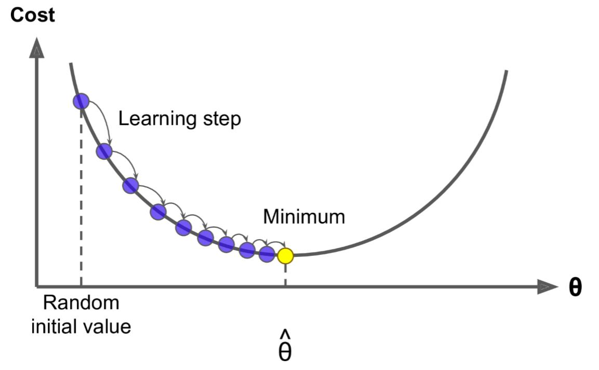

&emsp;&emsp;其实这就跟生活中的情形很像，比如你问一个朋友的工资是多少，他说你猜？那就很难了，他说你猜完我告诉你是猜高了还是猜低了，这样你就可以奔着对的方向一直猜下去，最后总会猜对！梯度下降法就是这样的，多次尝试。并且，在试的过程中还得想办法知道是不是在猜对的路上，说白了就是得到正确的反馈再调整然后继续猜才有意义~

&emsp;&emsp;这个就好比道士下山，我们把 Loss （或者称为Cost，即损失）曲线看成是**山谷**，如果<font color = 'red'>走过了</font>，就再<font color = 'green'>往回返</font>，所以是一个迭代的过程。


#### 1.3、梯度下降公式

&emsp;&emsp;这里梯度下降法的公式就是一个式子指导计算机迭代过程中如何去调整$\theta$，可以通过泰勒公式一阶展开来进行推导和证明：

一阶泰勒公式的形式如下：

$f(x) = f(x_0) + f'(x_0)(x - x_0) + R_1(x)$

其中，$f(x)$ 表示函数在点 $x$ 处的值，$f(x_0)$ 表示函数在点 $x_0$ 处的值，$f'(x_0)$ 表示函数在点 $x_0$ 处的一阶导数值，$x$ 表示自变量，$x_0$ 表示自变量的取值点，$R_1(x)$ 表示剩余项。

根据泰勒公式，我们可以将函数在点 $x_0$ 处的值和一阶导数值表示为：

<font color = 'red' size = 8>$f(x_0) \approx f(x) - f'(x_0)(x - x_0)$</font>

上式表示函数在点 $x_0$ 处的值可以近似表示为函数在点 $x$ 处的值减去 $f'(x_0)$ 与 $(x - x_0)$ 的乘积。

*  <font size = 8 color = 'red'>$\theta^{n + 1} = \theta^{n} - \alpha * gradient$</font>

  其中 $\alpha$ 表示学习率，gradient 表示梯度

* <font size = 8 color = 'green'>$\theta^{n + 1} = \theta^{n} - \alpha * \frac{\partial J(\theta)}{\partial \theta}$</font>

  有些公式，使用其他字母表示：

* <font size = 8>$\theta^{n + 1} = \theta^{n} - \eta * \frac{\partial J(\theta)}{\partial \theta}$</font>

* <font size = 8>$w_j^{n + 1} = w_j^{n} - \eta * \frac{\partial J(\theta)}{\partial \theta_j}$</font>


&emsp;&emsp;这里的 $w_j$ 就是 $\theta$ 中的某一个 j = 0...m，这里的 $\eta$ 就是梯度下降图里的<font color = 'green'>learning step</font>，很多时候也叫学习率 <font color = 'green'>learning rate</font>，很多时候也用 $\alpha$ 表示，这个学习率我们可以看作是下山迈的**步子**的大小，步子迈的大下山就快。


&emsp;&emsp;


学习率一般都是**正数**，如果在山左侧（曲线**左半边**）梯度是负的，那么这个负号就会把 $w_j$ 往大了调， 如果在山右侧（曲线右半边）梯度就是正的，那么负号就会把 $w_j$ 往小了调。每次 $w_j$ 调整的幅度就是 $\eta * gradient$，就是横轴上移动的距离。

&emsp;&emsp;因此，无论在左边，还是在右边，梯度下降都可以快速找到最优解，实现快速**下山**~

&emsp;&emsp;如果特征或维度越多，那么这个公式用的次数就越多，也就是每次迭代要应用的这个式子多次（多少特征，就应用多少次），所以其实上面的图不是特别准，因为 $\theta$ 对应的是很多维度，应该每一个维度都可以画一个这样的图，或者是一个多维空间的图。

* <font size = 8>$w_0^{n + 1} = w_0^{n} - \eta * \frac{\partial J(\theta)}{\partial \theta_0}$</font>
* <font size = 8>$w_1^{n + 1} = w_1^{n} - \eta * \frac{\partial J(\theta)}{\partial \theta_1}$</font>
* ……
* <font size = 8>$w_m^{n + 1} = w_m^{n} - \eta * \frac{\partial J(\theta)}{\partial \theta_m}$</font>
* 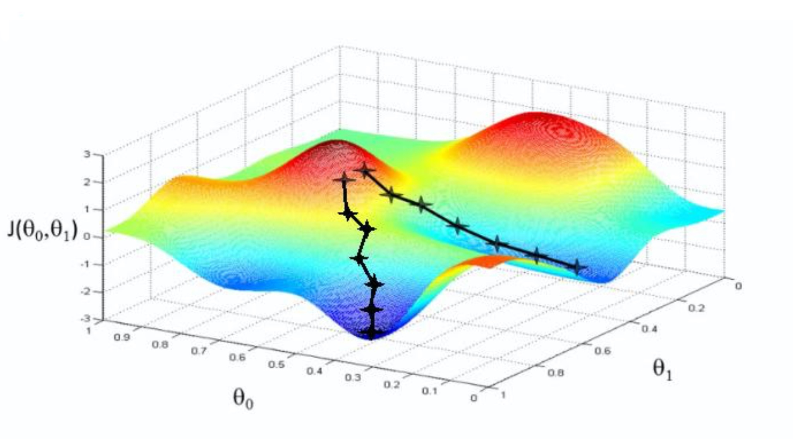

&emsp;&emsp;所以观察上图我们可以发现不是某一个 $\theta_0$ 或 $\theta_1$ 找到最小值就是最优解，而是它们一起找到 $J(\theta)$ 最小值才是最优解。


#### 1.4、学习率


- - 

  

根据我们上面讲的梯度下降公式，，然而如果步子迈的太大也会有问题，俗话说步子大了容易扯着蛋！，。。

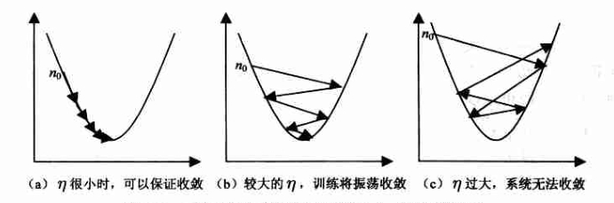

&emsp;&emsp;学习率的设置是门一门学问，一般我们会把它设置成一个比较小的正数，0.1、0.01、0.001、0.0001，都是常见的设定数值（然后根据情况调整）。一般情况下学习率在整体迭代过程中是不变，但是也可以设置成随着迭代次数增多学习率逐渐变小，因为越靠近山谷我们就可以步子迈小点，可以更精准的走入最低点，同时防止走过。还有一些深度学习的优化算法会自己控制调整学习率这个值，后面学习过程中这些策略在讲解代码中我们会一一讲到。

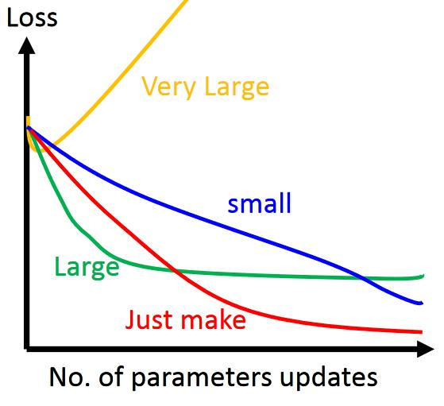


#### 1.5、全局最优化

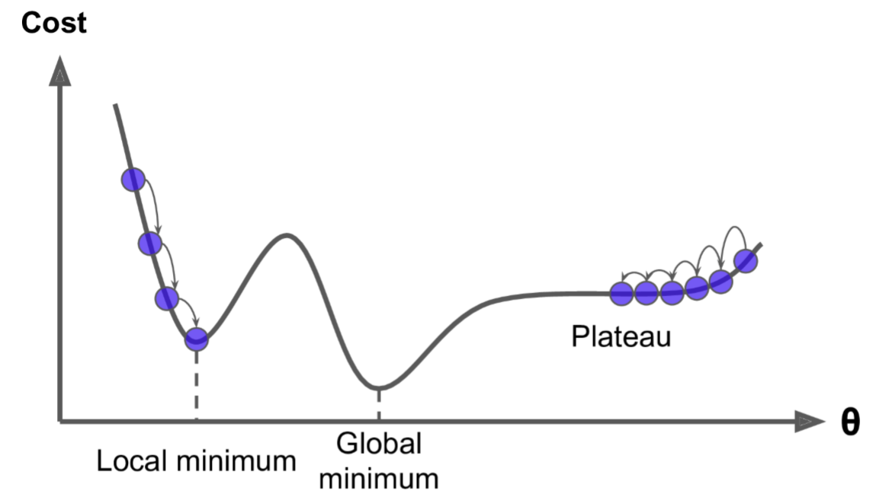

- 


#### 1.6、梯度下降步骤

梯度下降流程就是**“猜”**正确答案的过程:

* 1、**“瞎蒙”**，Random 随机数生成  $\theta$，随机生成一组数值 $w_0、w_1……w_n$ ，期望 $\mu$ 为 0 方差 $\sigma$ 为 1 的正太分布数据。

* 2、求**梯度** g（既导数） ，梯度代表曲线某点上的切线的斜率，沿着切线往下就相当于沿着坡度最陡峭的方向下降

* 3、if  g < 0, $\theta$  **变大**，if g > 0, $\theta$ **变小** $\theta^{n + 1} = \theta^{n} - \alpha * gradient$

* 4、判断是否**收敛** convergence，如果收敛跳出迭代，如果没有达到收敛，回第 2 步**再次**执行**2~4**步

  收敛的判断标准是：随着迭代进行损失函数Loss，变化非常微小甚至不再改变，即认为达到收敛

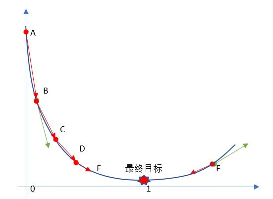


#### 1.7、代码模拟梯度下降

* 梯度下降优化算法，比正规方程，应用更加广泛

* 什么是梯度？

  * 梯度就是导数对应的值！

* 下降？

  * 涉及到优化问题，做减法

* 梯度下降呢？

  * 梯度方向下降，速度最快的~

&emsp;&emsp;接下来，我们使用代码来描述上面梯度下降的过程：

方程如下：

$f(x) = (x - 3.5)^2 - 4.5x + 10$

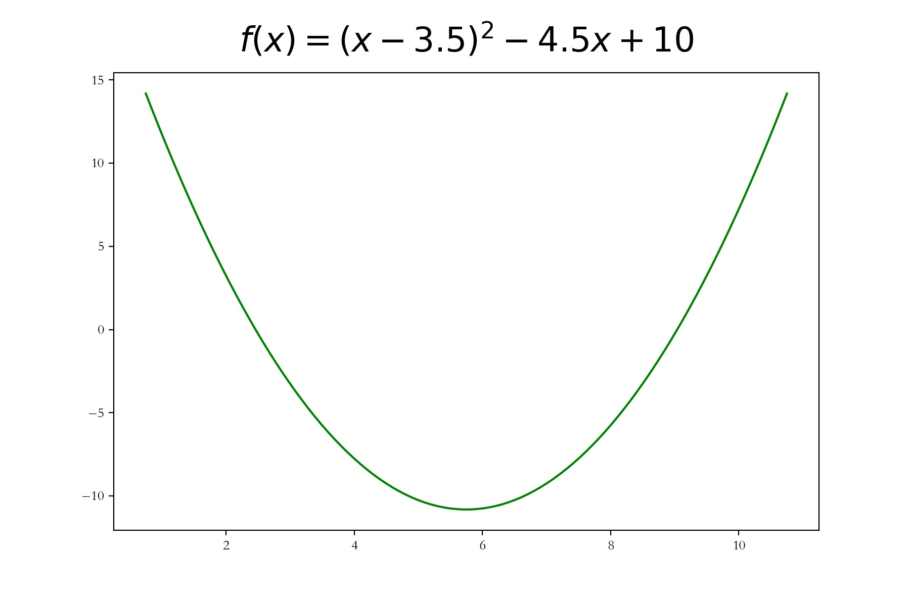

使用梯度下降的思想，来一步步逼近，函数的最小值。

```Python
import numpy as np
import matplotlib.pyplot as plt
f = lambda x : (x - 3.5)**2 -4.5*x + 10
# 导函数
d = lambda x :2*(x - 3.5) - 4.5 # 梯度 == 导数
# 梯度下降的步幅，比例，（学习率，幅度）
step = 0.1
# 求解当x等于多少的时候，函数值最小。求解目标值：随机生成的
# 相等于：'瞎蒙' ----> 方法 ----> 优化
x = np.random.randint(0,12,size = 1)[0]
# 梯度下降，每下降一步，每走一步，目标值，都会更新。
# 更新的这个新值和上一步的值，差异，如果差异很小（万分之一）
# 梯度下降退出
last_x = x + 0.02 # 记录上一步的值，首先让last_x和x有一定的差异！！！
# 精确率，真实计算，都是有误差，自己定义
precision = 1e-4
print('+++++++++++++++++++++', x)
x_ = [x]
while True:
    # 退出条件，精确度，满足了
    if np.abs(x - last_x) < precision:
        break     
    # 更新
    last_x = x
    x -= step*d(x) # 更新，减法：最小值
    x_.append(x)
    print('--------------------',x)
# 数据可视化
plt.rcParams['font.family'] = 'Kaiti SC'
plt.figure(figsize=(9,6))
x = np.linspace(5.75 - 5, 5.75 + 5, 100)
y = f(x)
plt.plot(x,y,color = 'green')
plt.title('梯度下降',size = 24,pad = 15)
x_ = np.array(x_)
y_ = f(x_)
plt.scatter(x_, y_,color = 'red')
plt.savefig('./5-梯度下降.jpg',dpi = 200)
```

函数的最优解是：**5.75**。你可以发现，随机赋值的变量 x ，无论**大于**5.75，还是**小于**5.75，经过梯度下降，最终都慢慢靠近5.75这个最优解！

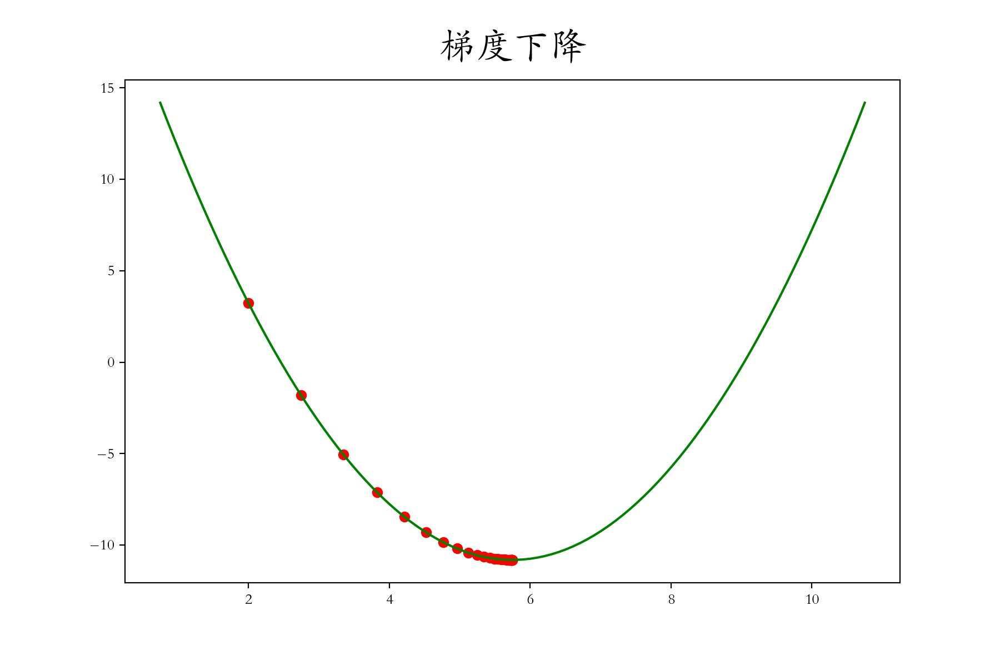

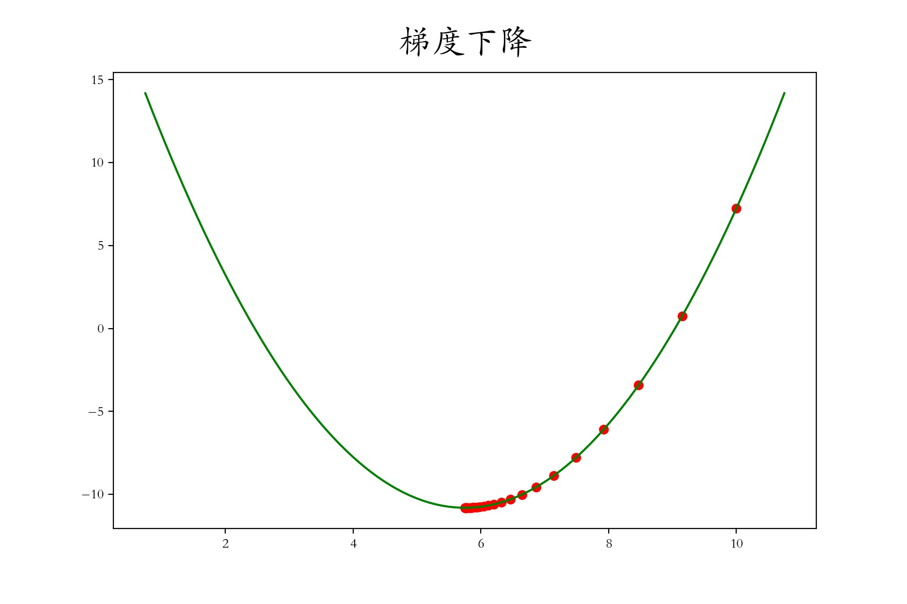

<font color = 'red'>**注意：**</font>

1. 梯度下降存在一定误差，不是完美解~
2. 在误差允许的范围内，梯度下降所求得的机器学习模型，是堪用的！
3. 梯度下降的步幅step，不能太大，俗话说步子不能迈的太大！
4. 精确度，可以根据实际情况调整
5. while True循环里面，持续进行梯度下降：

&emsp;&emsp; $\theta = \theta - \eta \frac{\partial}{\partial \theta}J(\theta)$ 其中的 $\eta $ 叫做学习率

&emsp;&emsp;$x = x - \eta\frac{\partial}{\partial x}f(x)$

&emsp;&emsp;$x = x - step*\frac{\partial}{\partial x} f(x)$ 其中的 $step $ 叫做学习率

&emsp;&emsp;$x = x - step * f'(x)$

6. while 循环退出条件是：x更新之后和上一次相差绝对值小于特定精确度！


### 2、梯度下降方法

#### 2.1、三种梯度下降不同

梯度下降分三类：批量梯度下降BGD（**Batch Gradient Descent**）、小批量梯度下降MBGD（**Mini-Batch Gradient Descent**）、随机梯度下降SGD（**Stochastic Gradient Descent**）。

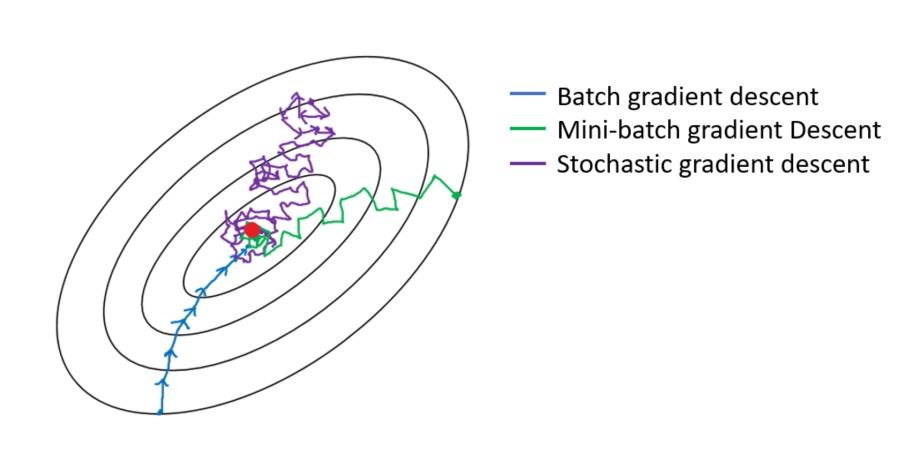

三种梯度下降有什么不同呢？我们从梯度下降步骤开始讲起，梯度下降步骤分一下四步：

* 1、随机赋值，Random 随机数生成  $\theta$，随机一组数值 $w_0、w_1……w_n$

* 2、求梯度 g ，梯度代表曲线某点上的切线的斜率，沿着切线往下就相当于沿着坡度最陡峭的方向下降

* 3、if  g < 0, $\theta$  变大，if g > 0, $\theta$ 变小

* 4、判断是否收敛 convergence，如果收敛跳出迭代，如果没有达到收敛，回第 2 步再次执行2~4步

  收敛的判断标准是：随着迭代进行损失函数Loss，变化非常微小甚至不再改变，即认为达到收敛


三种梯度下降不同，体现在第二步中：

* BGD是指在**每次迭代**使用**所有样本**来进行梯度的更新
* MBGD是指在**每次迭代**使用**一部分样本**（所有样本500个，使用其中一部分样本）来进行梯度的更新

* SGD是指**每次迭代**随机选择**一个样本**来进行梯度更新


#### 2.2、线性回归梯度更新公式

回顾上一讲公式！

最小二乘法公式如下：

<font size = 8 color = 'purple'>$</font>


矩阵写法：

<font size = 8 color = 'green'>$</font>


$$
\theta_j^{n + 1} = \theta_j^{n} - \eta * \frac{\partial J(\theta)}{\partial \theta_j}  \\
\frac{\partial J(\theta)}{\partial \theta_j} = \frac{\partial}{\partial \theta_j}\frac{1}{2}(h_{\theta}(x) - y)^2\\
= \frac{1}{2}*2(h_{\theta}(x) - y)\frac{\partial}{\partial \theta_j}(h_{\theta}(x) - y)\\
= (h_{\theta}(x) - y)\frac{\partial}{\partial \theta_j}(\sum\limits_{i = 0}^n\theta_ix_i - y)\\
= (h_{\theta}(x) - y)x_j \\


\theta_j^{n + 1} = \theta_j^{n} - \eta * (h_{\theta}(x) - y )x_j
$$


接着我们来讲解如何求解上面梯度下降的第 2 步，即我们要推导出损失函数的导函数来。

* <font size = 8>$</font> 其中 j 表示第 j 个系数


* <font size = 8>$</font>

<font size = 8>$</font><font color = 'red' size = 8>(1)</font>

<font size = 8>$ </font>  <font color = 'red' size = 8>(2)</font>

<font size = 8 color = 'green'>$</font>    <font color = 'red' size = 8>(3)</font>

&emsp;&emsp;$x^2$的导数就是 2x，根据链式求导法则，我们可以推出上面第（1）步。然后是多元线性回归，所以 $h_{\theta}(x)$ 就 是 $\theta^Tx$ 即是$w_0x_0 + w_1x_1 + …… + w_nx_n$ 即$\sum\limits_{i = 0}^n\theta_ix_i$。到这里我们是对 $\theta_j$ 来求偏导，那么和 $w_j$ 没有关系的可以忽略不计，所以只剩下 $x_j$。


&emsp;&emsp;我们可以得到结论就是 $\theta_j$ 对应的梯度与预测值 $\hat{y}$ 和真实值 y 有关，这里 $\hat{y}$ 和 y 是列向量（即多个数据），同时还与 $\theta_j$ 对应的特征维度 $x_j$ 有关，这里 $x_j$ 是原始数据集矩阵的第 j 列。如果我们分别去对每个维度 $\theta_0、\theta_1……\theta_n$ 求偏导，即可得到所有维度对应的梯度值。

* $g_0 = (h_{\theta}(x) - y)x_0$
* $g_1 = (h_{\theta}(x) - y)x_1$
* ……
* $g_j = (h_{\theta}(x) - y)x_j$

**总结：**

<font size = 6 color = 'green'>$</font> 


#### 2.3、批量梯度下降BGD

&emsp;&emsp;**批量梯度下降法**是最原始的形式，它是指在**每次迭代**使用**所有样本**来进行梯度的更新。每次迭代参数更新公式如下：

<font size = 6 color = 'green'>$\theta_j^{n + 1} = \theta_j^{n} - \eta *\frac{1}{n}\sum\limits_{i = 1}^{n} (h_{\theta}(x^{(i)}) - y^{(i)} )x_j^{(i)}$</font>

去掉 $\frac{1}{n}$ 也可以，因为它是一个常量，可以和 $\eta$  合并

<font size = 6 color = 'green'>$\theta_j^{n + 1} = \theta_j^{n} - \eta *\sum\limits_{i = 1}^{n} (h_{\theta}(x^{(i)}) - y^{(i)} )x_j^{(i)}$</font>

矩阵写法：

<font size = 6 color = 'green'>$\theta^{n + 1} = \theta^{n} - \eta * X^T(X\theta -y)$</font>


 其中 𝑖 = 1, 2, ..., n 表示样本数， 𝑗 = 0, 1……表示特征数，**这里我们使用了偏置项，即解决$x_0^{(i)} = 1$**。


**注意这里更新时存在一个求和函数，即为对所有样本进行计算处理！**


**优点：**
  （1）一次迭代是对所有样本进行计算，此时利用矩阵进行操作，实现了并行。
  （2）由全数据集确定的方向能够更好地代表样本总体，从而更准确地朝向极值所在的方向。当目标函数为凸函数时，BGD一定能够得到全局最优。
**缺点：**
  （1）当样本数目 n 很大时，每迭代一步都需要对所有样本计算，训练过程会很慢。


从迭代的次数上来看，BGD迭代的次数相对较少。其迭代的收敛曲线示意图可以表示如下：

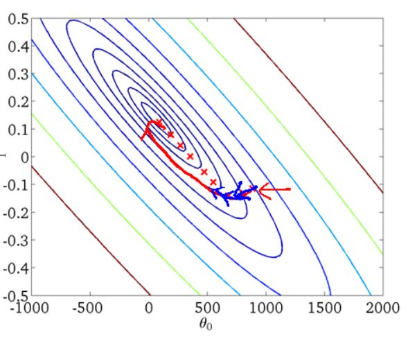


#### 2.4、随机梯度下降SGD


**批量梯度下降**算法每次都会使用**全部**训练样本，因此这些计算是冗余的，因为每次都使用完全相同的样本集。而**随机梯度下降**算法每次只随机选择**一个**样本来更新模型参数，因此每次的学习是非常快速的。

  **优点：**
  （1）由于不是在全部训练数据上的更新计算，而是在每轮迭代中，随机选择一条数据进行更新计算，这样每一轮参数的更新速度大大加快。
  **缺点：**
  （1）准确度下降。由于即使在目标函数为强凸函数的情况下，SGD仍旧无法做到线性收敛。
  （2）可能会收敛到局部最优，由于单个样本并不能代表全体样本的趋势。

  **解释一下为什么SGD收敛速度比BGD要快：**
  * 批量梯度下降（BGD）：在每次迭代时，BGD 计算整个训练集的梯度，并更新模型参数。因此，每次迭代都需要处理整个数据集，计算量较大，收敛速度较慢。
* 随机梯度下降（SGD）：在每次迭代时，SGD 从训练集中随机选择一个样本，计算该样本的梯度，并更新模型参数。因此，每次迭代的计算量较小，收敛速度相对较快。

SGD 相比 BGD 收敛速度快的原因主要有以下几点：

1. 计算效率：SGD 每次迭代只需要计算一个样本的梯度，计算效率更高。相反，BGD 需要在每次迭代中计算整个数据集的梯度，计算成本较高。
2. 随机性：SGD 的随机性有助于跳出局部最优解。由于每次迭代只使用一个样本，SGD 的梯度估计可能并不准确，但这种不准确性有时候可以帮助算法跳出局部最优解，从而更快地找到全局最优解。
3. 可在线学习：SGD 可以很容易地。这对于处理大规模数据集或需要实时更新模型的场景非常有用。

然而，SGD 的收敛过程相对不稳定，可能会在最优解附近波动。为了平衡收敛速度和稳定性，我们可以使用小批量梯度下降（Mini-batch Gradient Descent），它结合了 BGD 和 SGD 的优点，每次迭代使用一个小批量的样本来计算梯度并更新模型参数。

从迭代的次数上来看，SGD迭代的次数较多，在解空间的搜索过程就会盲目一些。其迭代的收敛曲线示意图可以表示如下：

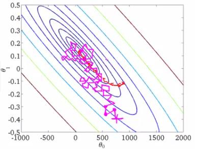


#### 2.5、小批量梯度下降MBGD

**小批量梯度下降**，是对批量梯度下降以及随机梯度下降的一个**折中**办法。其思想是：**每次迭代**使用总样本中的一部分（batch_size）样本来对参数进行更新。这里我们假设 batch_size = 32，样本数 n = 1000 。实现了更新速度与更新次数之间的平衡。每次迭代参数更新公式如下：


- 算法特点：是一个折中的算法，每次迭代使用一部分样本来计算斜率

- 适应场景：小批量梯度下降是梯度下降的推荐变体，特别是在深度学习中。每次随机选择2的幂数个样本来进行学习，例如：8、16、32、64、128、256。因为计算机的结构就是二进制的。但是也要根据具体问题而选择，实践中可以进行多次试验， 选择一个更新速度与更次次数都较适合的样本数

- 算法公式：
  $$
  \theta_j^{n + 1} = \theta_j^{n} - \eta *\frac{1}{batch\_size}\sum\limits_{i = 1}^{batch\_size} (h_{\theta}(x^{(i)}) - y^{(i)} )x_j^{(i)}
  $$
  

  

  

相对于随机梯度下降算法，小批量梯度下降算法降低了收敛波动性， 即降低了参数更新的方差，使得更新更加稳定。相对于全量梯度下降，其提高了每次学习的速度。并且其不用担心内存瓶颈从而可以利用矩阵运算进行高效计算。

一般情况下，。


MBGD梯度下降迭代的收敛曲线更加温柔一些：


#### 2.6、梯度下降优化

虽然梯度下降算法效果很好，并且广泛使用，但是不管用上面三种哪一种，都存在一些挑战与问题，我们可以从以下几点进行优化:

1. 选择一个合理的学习速率很难。如果学习速率过小，则会导致收敛速度很慢。如果学习速率过大，那么其会阻碍收敛，即在极值点附近会振荡。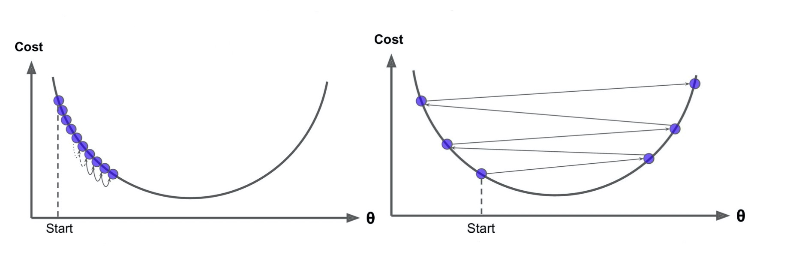

2. 

3. 

4. 

5. 

6. 

7. 

8. 

9. 

10. 

11. 

12. 学习速率调整，试图在每次更新过程中， 改变学习速率。从经验上看，**学习率在一开始要保持大些来保证收敛速度，在收敛到最优点附近时要小些以避免来回震荡。**比较简单的学习率调整可以通过 **学习率衰减（Learning Rate Decay）**的方式来实现。假设初始化学习率为 $\eta_0$，在第 t 次迭代时的学习率 $\eta_t$。常用的衰减方式为可以设置为 **按迭代次数** 进行衰减，迭代次数越大，学习率越小！

13. 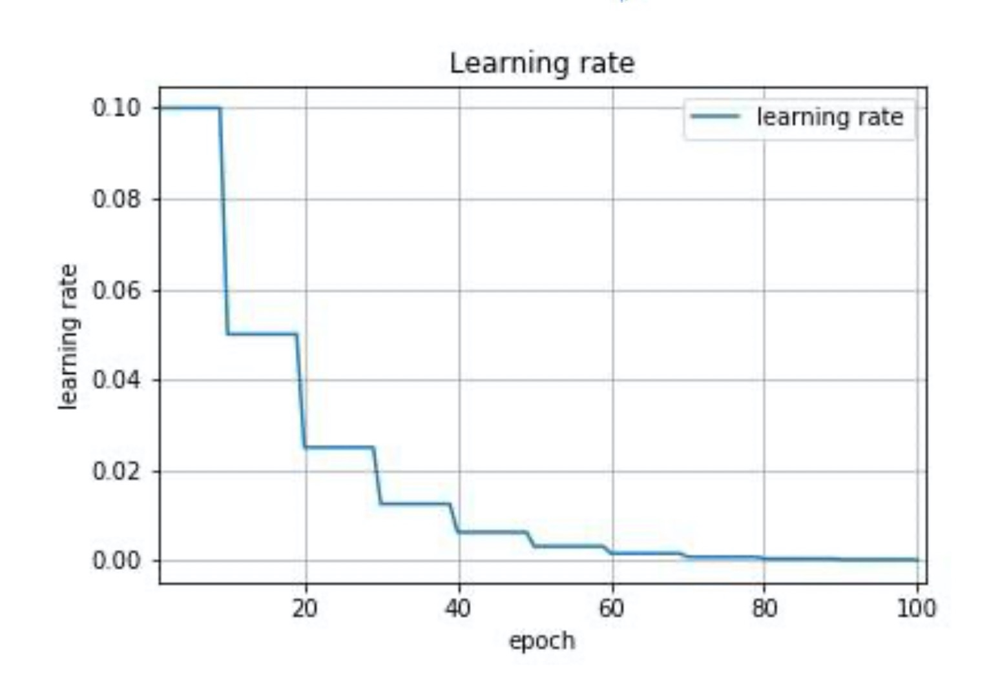

    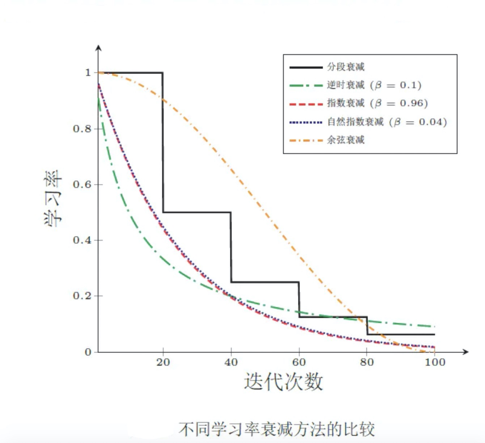

14. 模型

15. 

16. 

17. 

18. 

19. 所有的参数每次更新都是使用相同的学习速率。如果数据特征是稀疏的，或者每个特征有着不同的统计特征与空间，那么便不能在每次更新中每个参数使用相同的学习速率，那些很少出现的特征应该使用一个相对较大的学习速率。另一种高效的方式，数据预处理，归一化！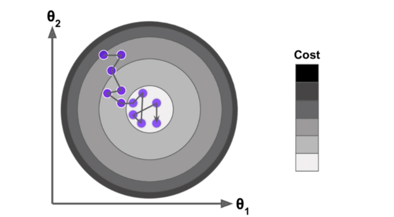

20. 对于非凸目标函数，容易陷入那些次优的局部极值点中，如在神经网路中。那么如何避免呢。

    简单的问题，一般使用随机梯度下降即可解决。在深度学习里，对梯度下降进行了很多改进，比如：自适应梯度下降。在深度学习章节，我们会具体介绍。

21. 

22. 

23. 

24. 

25. 

26. 

27. 

28. 

29. 

30. 

31. 轮次和批次

    轮次：epoch，轮次顾名思义是把我们已有的训练集数据学习多少轮，迭代多少次。

    批次：batch，批次这里指的的我们已有的训练集数据比较多的时候，一轮要学习太多数据， 那就把一轮次要学习的数据分成多个批次，一批一批数据的学习。

    

    

    就好比，你要背诵一片《赤壁赋》，很长。你在背诵的时候，一段段的背诵，就是批次batch。花费了一天终于背诵下来了，以后的9天，每天都进行一轮背诵复习，这就是轮次epoch。这样，《赤壁赋》的背诵效果，就非常牢固了。

    在进行，机器学习训练时，我们也要合理选择轮次和批次~


### 3、代码实战梯度下降

#### 3.1、批量梯度下降BGD

**这里我们使用了偏置项，即解决$x_0^{(i)} = 1$**。一元一次线性回归问题。

```Python
import numpy as np
import matplotlib.pyplot as plt
# 创建数据
X = np.random.rand(100,1)
w,b = np.random.randint(1,10,size = 2)
y = w * X + b + np.random.randn(100,1)*0.2

# 初始化 系数
# 斜率和截距
theta = np.random.randn(2,1) # 随机，瞎蒙
# 梯度下降，轮次
epoches = 2000
# 学习率
# learning_rate = 0.01
t0,t1 = 5,1000
# 逆时衰减，learning 5/1000 = 0.005
def learning_rate_schedule(t):
    return t0/(t1 + t)

# 偏置项，截距b，w0 系数 1
# f(x) = w0 * 1 + w1 * x1 + w2 * x2 + ……
X_ = np.c_[X,np.ones((100,1))] # np.concatenate

# 实现梯度下降
for epoche in range(epoches):
    # 根据公式，计算梯度
    g = X_.T.dot(X_.dot(theta) - y)
    learning_rate = learning_rate_schedule(epoche)
    theta = theta - learning_rate * g
print('真实的斜率和截距是：',w,b)
print('梯度下降计算所得是：',theta)

plt.scatter(X,y,color = 'red')
x_ = np.linspace(0,1,100)
y_ = x_ * theta[0,0] + theta[1,0]
plt.plot(x_,y_,color = 'green')
```


**这里我们使用了偏置项，即解决$x_0^{(i)} = 1$**。多元一次线性回归问题。

```Python
import numpy as np
import matplotlib.pyplot as plt
# 创建数据
X = np.random.rand(100,7) # 7个特征
w = np.random.randint(1,10,size = (7,1))
b = np.random.randint(1,10,size = 1) # 一个截距
y = X.dot(w) + b + np.random.randn(100,1)

# 初始化 系数
# 斜率和截距
theta = np.random.randn(8,1) # 随机，瞎蒙
# 梯度下降，轮次
epoches = 2000
# 学习率
# learning_rate = 0.01
t0,t1 = 1,100
# 逆时衰减，learning 5/1000 = 0.005
def learning_rate_schedule(t):
    return t0/(t1 + t)

# 偏置项，截距b，w0 系数 1
# f(x) = w0 * 1 + w1 * x1 + w2 * x2 + ……
X_ = np.c_[X,np.ones((100,1))] # np.concatenate

# 实现梯度下降
for epoche in range(epoches):
    # 根据公式，计算梯度
    g = X_.T.dot(X_.dot(theta) - y)
    learning_rate = learning_rate_schedule(epoche)
    theta = theta - learning_rate * g
print('真实的斜率和截距是：',w,b)
print('梯度下降计算所得是：',theta.round(5))
```


#### 3.2、随机梯度下降SGD

**这里我们使用了偏置项，即解决$x_0^{(i)} = 1$**。一元一次线性回归问题。

```Python
%%time
import numpy as np
import matplotlib.pyplot as plt
from sklearn.metrics import mean_squared_error # 均方误差
rs = np.random.RandomState(seed = 42) # 固定随机数种子

# 1、创建数据集X，y
X = 2 * rs.rand(100, 1)
w,b = rs.randint(1,10,size = 2)
y = w * X + b + np.random.randn(100, 1)

# 2、使用偏置项x_0 = 1，更新X
X_ = np.c_[X, np.ones((100, 1))]

# 3、创建超参数轮次、样本数量
epoches = 50

# 4、定义一个函数来调整学习率
t0, t1 = 1, 100
def learning_rate_schedule(t):
    return t0/(t+t1)

# 5、初始化 W0...Wn，标准正太分布创建W
theta = rs.randn(2, 1) # 最后一个是偏置项，截距

# 6、梯度下降
loss = []
for i in range(epoches):
    indexes = np.arange(100)
    np.random.shuffle(indexes) # 打乱顺序
    X_ = X_[indexes] # 重排，洗牌
    y = y[indexes]
    for X_i,y_i in zip(X_,y): # 这里的依次遍历，相当于，随机抽取
        X_i = X_i.reshape(-1,2)
        y_i = y_i.reshape(-1,1)
        g = X_i.T.dot(X_i.dot(theta) - y_i)
        learning_rate = learning_rate_schedule(i)
        theta -= learning_rate * g
    y_pred = X_.dot(theta) # 根据更新的系数，计算预测的目标值
    loss.append(mean_squared_error(y,y_pred))
print('正确的斜率和截距是：',w,b)
print('SGD计算的斜率截距是：',theta)

plt.plot(loss)
plt.xlabel('Epoches')
plt.ylabel('Function Loss')
plt.title('Epoches VS Function Loss')
```


**这里我们使用了偏置项，即解决$x_0^{(i)} = 1$**。多元一次线性回归问题。

```Python
%%time
import numpy as np
import matplotlib.pyplot as plt
from sklearn.metrics import mean_squared_error # 均方误差
rs = np.random.RandomState(seed = 42) # 固定随机数种子

# 1、创建数据集X，y
X = 2 * rs.rand(100, 7)
w = rs.randint(1,10,size = (7,1))
b = rs.randint(1,10,size = (1,1))
y = X.dot(w) + b + np.random.randn(100, 1)

# 2、使用偏置项x_0 = 1，更新X
X_ = np.c_[X, np.ones((100, 1))]

# 3、创建超参数轮次、样本数量
epoches = 100

# 4、定义一个函数来调整学习率
t0, t1 = 1, 100
def learning_rate_schedule(t):
    return t0/(t+t1)

# 5、初始化 W0...Wn，标准正太分布创建W
theta = rs.randn(8, 1) # 最后一个是偏置项，截距

# 6、梯度下降
loss = []
for i in range(epoches):
    indexes = np.arange(100)
    np.random.shuffle(indexes) # 打乱顺序
    X_ = X_[indexes] # 重排，洗牌
    y = y[indexes]
    
    for X_i,y_i in zip(X_,y): # 这里的依次遍历，相当于，随机抽取
        X_i = X_i.reshape(1,-1)
        y_i = y_i.reshape(1,-1)
        g = X_i.T.dot(X_i.dot(theta) - y_i)
        learning_rate = learning_rate_schedule(i)
        theta -= learning_rate * g
    y_pred = X_.dot(theta) # 根据更新的系数，计算预测的目标值
    loss.append(mean_squared_error(y,y_pred))
print('正确的斜率和截距是：',w,b)
print('SGD计算的斜率截距是：',theta)

plt.plot(loss)
plt.xlabel('Epoches')
plt.ylabel('Function Loss')
plt.title('Epoches VS Function Loss')
```


**scikit-learn中SGD算法使用**

```Python
from sklearn.linear_model import SGDRegressor
import numpy as np
import matplotlib.pyplot as plt
from sklearn.metrics import mean_squared_error # 均方误差
rs = np.random.RandomState(seed = 42) # 固定随机数种子

# 1、创建数据集X，y
X = 2 * rs.rand(100, 7)
w = rs.randint(1,10,size = (7,1))
b = rs.randint(1,10,size = (1,1))
y = X.dot(w) + b + np.random.randn(100, 1)

# 2、使用偏置项x_0 = 1，更新X
X_ = np.c_[X, np.ones((100, 1))]

model = SGDRegressor(fit_intercept = False,max_iter=2000,tol = 1e-5)
model.fit(X_,y.ravel())

model.score(X_,y)
print('scikit-learn模型，SGD返回的系数是：',model.coef_)
print('正确的斜率和截距是：',w.ravel(),b)
```


#### 3.3、小批量梯度下降MBGD

**这里我们使用了偏置项，即解决$x_0^{(i)} = 1$**。一元一次线性回归问题。

```Python
import numpy as np
import matplotlib.pyplot as plt
from sklearn.metrics import mean_squared_error # 均方误差

# 1、创建数据集X，y
X = np.random.rand(100, 1)
w,b = np.random.randint(1,10,size = 2)
y = w * X + b + np.random.randn(100, 1)

# 2、使用偏置项x_0 = 1，更新X
X = np.c_[X, np.ones((100, 1))]

# 3、定义一个函数来调整学习率
t0, t1 = 1, 100
def learning_rate_schedule(t):
    return t0/(t+t1)

# 4、创建超参数轮次、样本数量、小批量数量
epochs = 50
n = 100
batch_size = 16
num_batches = int(n / batch_size) # 6次

# 5、初始化 W0...Wn，标准正太分布创建W
theta = np.random.randn(2, 1)
loss = []

# 6、梯度下降
for epoch in range(epoches):
    indexes = np.arange(100)
    np.random.shuffle(indexes)
    X = X[indexes]
    y = y[indexes]
    learning_rate = learning_rate_schedule(epoch)
    for i in range(num_batches):
        X_batch = X[batch_size * i : batch_size * (1 + i)] # 16个样本
        y_batch = y[batch_size * i : batch_size * (1 + i)]
        g = X_batch.T.dot(X_batch.dot(theta) - y_batch)
        theta -= g * learning_rate
    y_pred = X.dot(theta)
    loss.append(mean_squared_error(y,y_pred))

print('正确的斜率和截距是：',w,b)
print('SGD计算的斜率截距是：',theta)

plt.plot(loss)
plt.xlabel('Epoches')
plt.ylabel('Function Loss')
plt.title('Epoches VS Function Loss')
```

**这里我们使用了偏置项，即解决$x_0^{(i)} = 1$**。多元一次线性回归问题。

```Python
import numpy as np
import matplotlib.pyplot as plt
from sklearn.metrics import mean_squared_error # 均方误差

# 1、创建数据集X，y
X = np.random.rand(100, 5)
w = np.random.randint(1,10,size = (5,1))
b = np.random.randint(1,10,size = (1,1))
y = X.dot(w) + b + np.random.randn(100, 1)
print('------------',y.shape)

# 2、使用偏置项x_0 = 1，更新X
X = np.c_[X, np.ones((100, 1))]

# 3、定义一个函数来调整学习率
t0, t1 = 1, 100
def learning_rate_schedule(t):
    return t0/(t+t1)

# 4、创建超参数轮次、样本数量、小批量数量
epochs = 100
n = 100
batch_size = 16
num_batches = int(n / batch_size) # 12次

# 5、初始化 W0...Wn，标准正太分布创建W
theta = np.random.randn(6, 1)
loss = []

# 6、梯度下降
for epoch in range(epoches):
    indexes = np.arange(100)
    np.random.shuffle(indexes)
    X = X[indexes]
    y = y[indexes]
    learning_rate = learning_rate_schedule(epoch)
    for i in range(num_batches):
        X_batch = X[batch_size * i : batch_size * (1 + i)] # 16个样本
        y_batch = y[batch_size * i : batch_size * (1 + i)]
        g = X_batch.T.dot(X_batch.dot(theta) - y_batch)
        theta -= g * learning_rate
    y_pred = X.dot(theta)
    loss.append(mean_squared_error(y,y_pred))

print('正确的斜率和截距是：',w.ravel(),b)
print('SGD计算的斜率截距是：',theta.ravel().round(4))

plt.plot(loss)
plt.xlabel('Epoches')
plt.ylabel('Function Loss')
plt.title('Epoches VS Function Loss')
```


