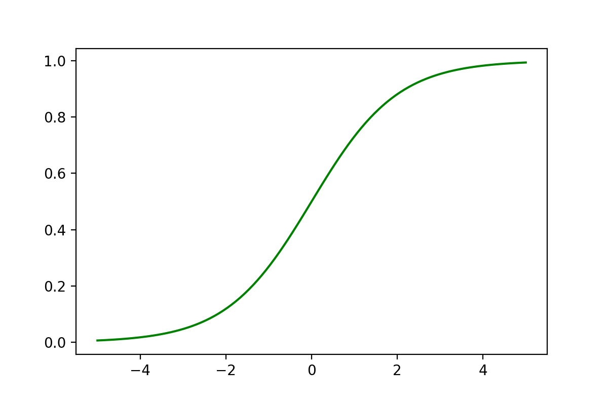
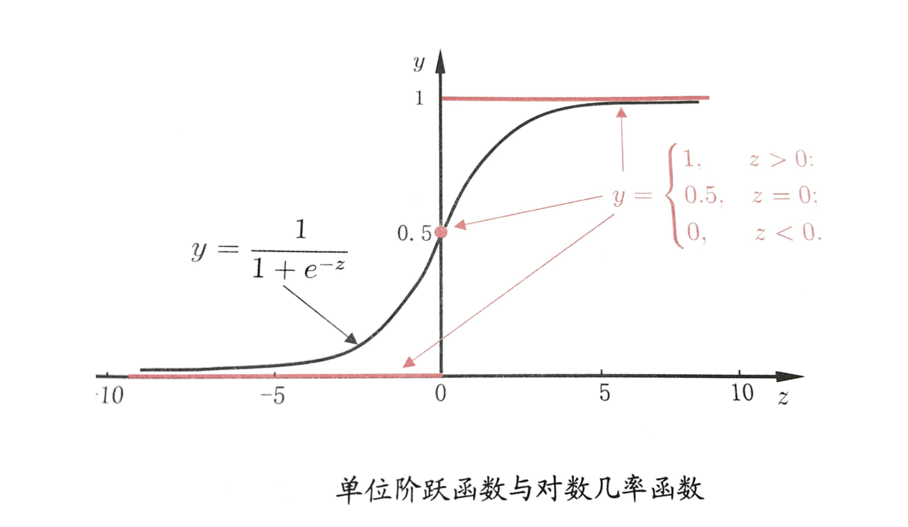
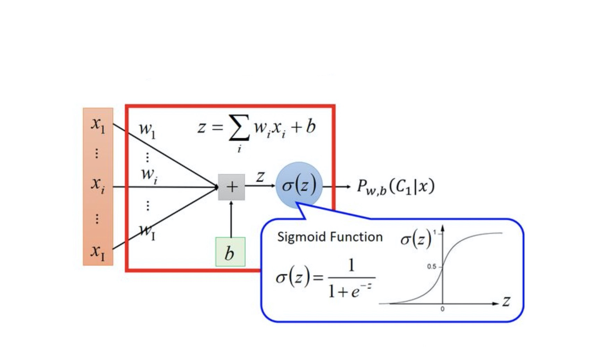
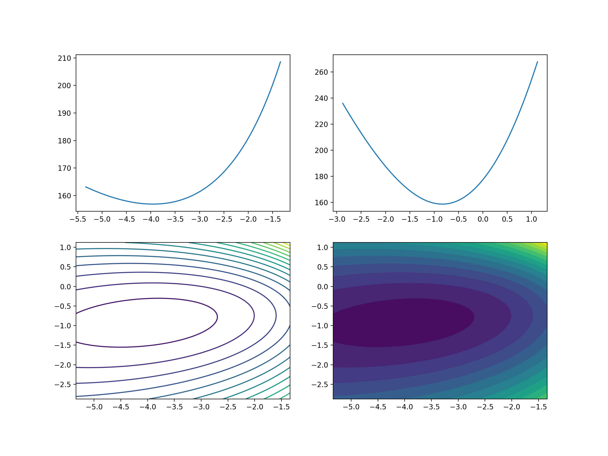
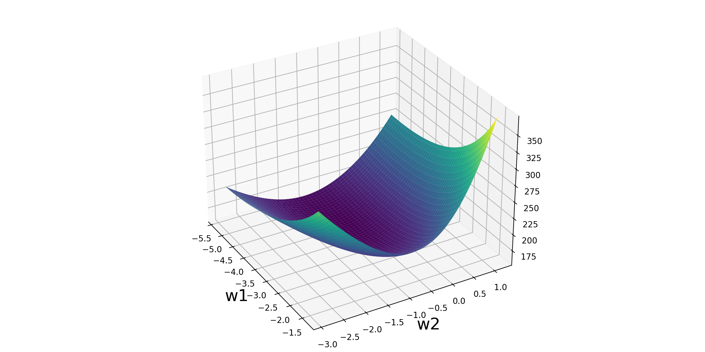
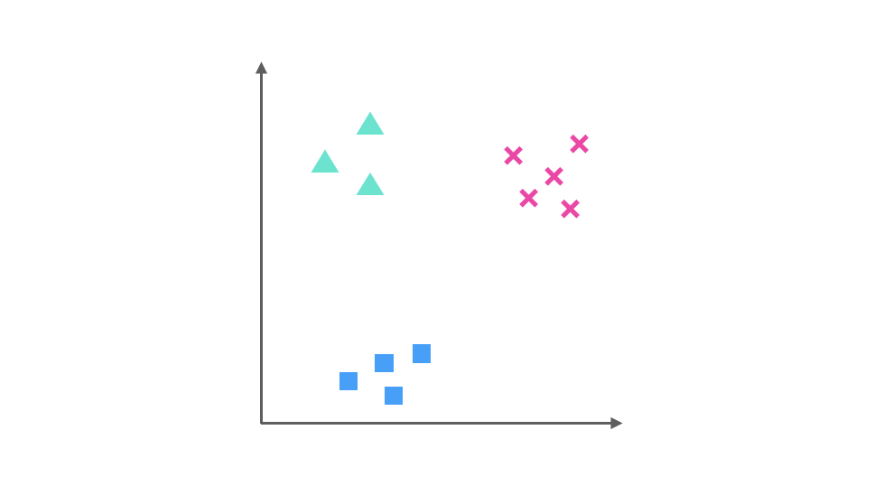
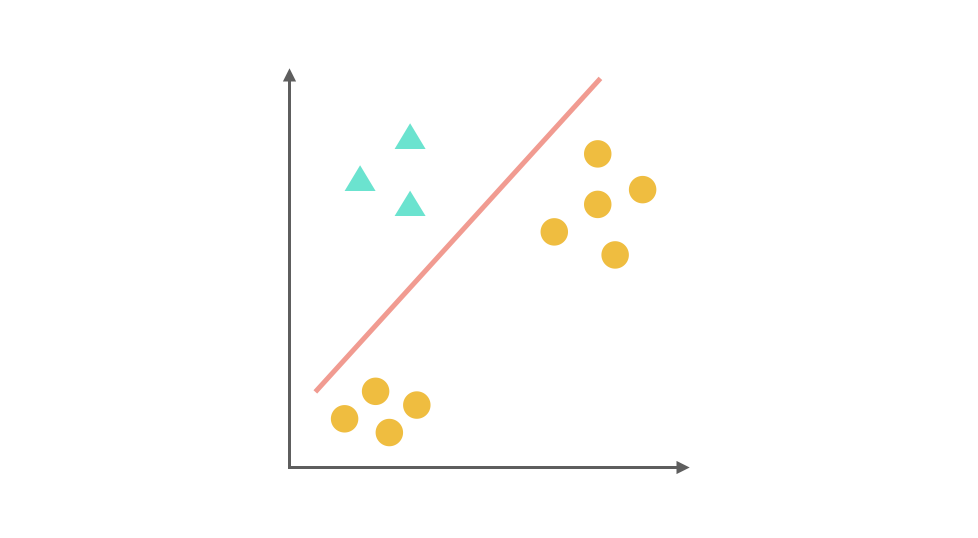
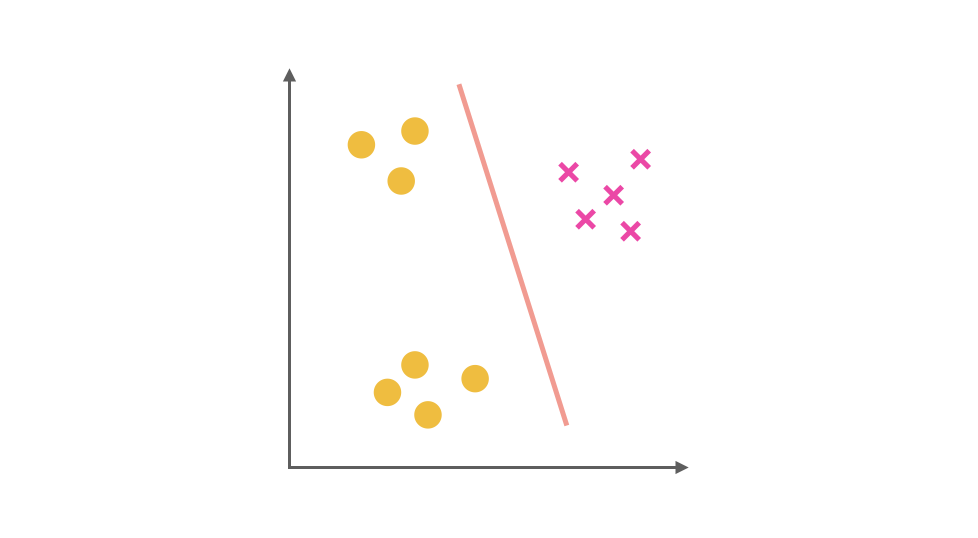
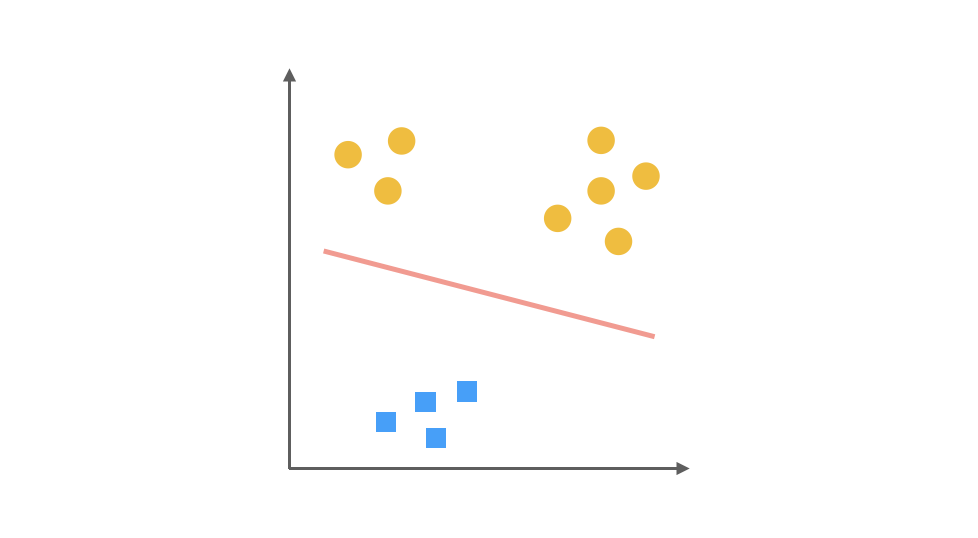
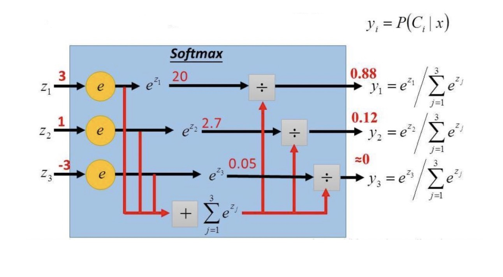

[toc]

### 1、逻辑斯蒂回归

#### 1.1、逻辑斯蒂回归是什么

&emsp;&emsp;逻辑回归**不是**一个回归的算法，逻辑回归是一个**分类**【用于二分类】的算法，好比卡巴斯基不是司机，红烧狮子头没有狮子头一样。 

​        那为什么逻辑回归不叫逻辑分类？因为逻辑回归算法是基于多元线性回归的算法。而正因为此，逻辑回归这个分类算法是线性的分类器。

&emsp;&emsp;逻辑回归中对应一条非常重要的**S型曲线**，对应的函数是Sigmoid函数：

<font size = 6>$f(x) = \frac{1}{1 + e^{-x}}$</font>

它有一个非常棒的特性，其**导数**可以用其自身表示：

<font size = 6>$\begin{aligned}f'(x) &= \frac{e^{-x}}{(1 + e^{-x})^2} \\\\&=\frac{1}{1+e^{-x}} * \frac{1 + e^{-x} - 1}{1 + e^{-x}} \\\\&=\frac{1}{1+e^{-x}} * (1- \frac{1}{1+e^{-x}})\\\\&= f(x) * (1 - f(x))\end{aligned}$</font>


```Python
import numpy as np
import matplotlib.pyplot as plt
def sigmoid(x):
    return 1/(1 + np.exp(-x))
x = np.linspace(-5,5,100)
y = sigmoid(x)
plt.plot(x,y,color = 'green')
```




#### 1.2、Sigmoid函数介绍

&emsp;&emsp;逻辑回归就是在多元线性回归基础上把结果缩放到 0 ~ 1 之间。 $h_{\theta}(x)$ 【概率函数，用于分类，分类的目标函数】越接近 1 越是**正例**，$h_{\theta}(x)$ 越接近 0 越是**负例**，根据中间 0.5 将数据分为二类。其中$h_{\theta}(x)$ 就是概率函数~

<font size = 8>$h_{\theta}(x) = g(\theta^Tx) = \frac{1}{1 + e^{-\theta^Tx}}$</font>


&emsp;&emsp;分类器的本质就是要找到分界，所以当我们把 0.5 作为分类边界时，我们要找的就是 $\hat{y} = h_{\theta}(x) = \frac{1}{1 + e^{-\theta^Tx}} = 0.5$ ，即 $z = \theta^Tx = 0$ 时，$\theta$ 的解~



求解过程如下：



&emsp;&emsp;什么事情，都要做到知其然，知其所以然，我们知道二分类有个特点就是正例的概率 + 负例的概率 = 1。一个非常简单的试验是只有两种可能结果的试验，比如正面或反面，成功或失败，有缺陷或没有缺陷，病人康复或未康复等等。为方便起见，记这两个可能的结果为 0 和 1，下面的定义就是建立在这类试验基础之上的。 如果随机变量 x 只取 0 和 1 两个值，并且相应的概率为：

* $Pr(x = 1) = p; Pr(x = 0) = 1-p; 0 < p < 1$

&emsp;&emsp;则称随机变量 x 服从参数为 p 的**Bernoulli**伯努利分布( 0-1分布)，则 x 的概率函数可写：

* $f(x | p) = \begin{cases}p^x(1 - p)^{1-x}, &x =  1、0\\0,& x \neq 1、0\end{cases}$ 

&emsp;&emsp;逻辑回归二分类任务会把正例的 label 设置为 1，负例的 label 设置为 0，对于上面公式就是 x = 0、1。


### 2、逻辑回归公式推导

#### 2.1、损失函数推导

&emsp;&emsp;这里我们依然会用到最大似然估计思想，根据若干已知的 X,y(训练集) 找到一组 $\theta$ 使得 X 作为已知条件下 y 发生的概率最大。

<font size = 6>$P(y|x;\theta) = \begin{cases}h_{\theta}(x), &y =  1\\1-h_{\theta}(x),& y =  0\end{cases}$ </font>

**整合到一起（二分类就两种情况：1、0）得到<font color = 'green'>逻辑回归表达式</font>：**

<font size = 6 color = 'green'>$P(y|x;\theta) = (h_{\theta}(x))^{y}(1 - h_{\theta}(x))^{1-y}$</font>


我们假设训练样本相互独立，那么似然函数表达式为:

<font size = 6>$L(\theta) = \prod\limits_{i = 1}^nP(y^{(i)}|x^{(i)};\theta)$</font>


<font size = 6>$L(\theta) = \prod\limits_{i=1}^n(h_{\theta}(x^{(i)}))^{y^{(i)}}(1 - h_{\theta}(x^{(i)}))^{1-y^{(i)}}$</font>

<font color = red size = 6>对数转换，自然底数为底</font>

<font size = 5>$l(\theta) = \ln{L(\theta)} =\ln( \prod\limits_{i=1}^n({h_{\theta}(x^{(i)}))^{y^{(i)}}}{(1 - h_{\theta}(x^{(i)}))^{1-y^{(i)}}})$​​</font>


化简，累乘变累加：

<font size = 5>$l(\theta) = \ln{L(\theta)} = \sum\limits_{i = 1}^n(y^{(i)}\ln(h_{\theta}(x^{(i)})) + (1-y^{(i)})\ln(1-h_{\theta}(x^{(i)})))$</font>


&emsp;&emsp;**总结**，得到了逻辑回归的表达式，下一步跟线性回归类似，构建似然函数，然后最大似然估计，最终推导出 $\theta$ 的迭代更新表达式。只不过这里用的不是梯度下降，而是梯度上升，因为这里是最大化似然函数。通常我们一提到损失函数，往往是求最小，这样我们就可以用**梯度下降**来求解。最终损失函数就是上面公式加负号的形式:

<font size = 5 color = 'green'>$J(\theta) = -l(\theta) = -\sum\limits_{i = 1}^n[y^{(i)}\ln(h_{\theta}(x^{(i)})) + (1-y^{(i)})\ln(1-h_{\theta}(x^{(i)}))]$</font>


#### 2.2、立体化呈现

```Python
from sklearn import datasets
from sklearn.linear_model import LogisticRegression
import numpy as np
import matplotlib.pyplot as plt
from mpl_toolkits.mplot3d import Axes3D
from sklearn.preprocessing import scale # 数据标准化Z-score

# 1、加载乳腺癌数据
data = datasets.load_breast_cancer()
X, y = scale(data['data'][:, :2]), data['target']

# 2、求出两个维度对应的数据在逻辑回归算法下的最优解
lr = LogisticRegression()
lr.fit(X, y)

# 3、分别把两个维度所对应的参数W1和W2取出来
w1 = lr.coef_[0, 0]
w2 = lr.coef_[0, 1]
print(w1, w2)

# 4、已知w1和w2的情况下，传进来数据的X，返回数据的y_predict
def sigmoid(X, w1, w2):
    z = w1*X[0] + w2*X[1]
    return 1 / (1 + np.exp(-z))

# 5、传入一份已知数据的X，y，如果已知w1和w2的情况下，计算对应这份数据的Loss损失
def loss_function(X, y, w1, w2):
    loss = 0
    # 遍历数据集中的每一条样本，并且计算每条样本的损失，加到loss身上得到整体的数据集损失
    for x_i, y_i in zip(X, y):
        # 这是计算一条样本的y_predict，即概率
        p = sigmoid(x_i, w1, w2)
        loss += -1*y_i*np.log(p)-(1-y_i)*np.log(1-p)
    return loss

# 6、参数w1和w2取值空间
w1_space = np.linspace(w1-2, w1+2, 100)
w2_space = np.linspace(w2-2, w2+2, 100)
loss1_ = np.array([loss_function(X, y, i, w2) for i in w1_space])
loss2_ = np.array([loss_function(X, y, w1, i) for i in w2_space])

# 7、数据可视化
fig1 = plt.figure(figsize=(12, 9))
plt.subplot(2, 2, 1)
plt.plot(w1_space, loss1_)

plt.subplot(2, 2, 2)
plt.plot(w2_space, loss2_)

plt.subplot(2, 2, 3)
w1_grid, w2_grid = np.meshgrid(w1_space, w2_space)
loss_grid = loss_function(X, y, w1_grid, w2_grid)
plt.contour(w1_grid, w2_grid, loss_grid,20)

plt.subplot(2, 2, 4)
plt.contourf(w1_grid, w2_grid, loss_grid,20)

# 8、3D立体可视化
fig2 = plt.figure(figsize=(12,6))
ax = Axes3D(fig2)
ax.plot_surface(w1_grid, w2_grid, loss_grid,cmap = 'viridis')
plt.xlabel('w1',fontsize = 20)
plt.ylabel('w2',fontsize = 20)
ax.view_init(30,-30)
```






### 3、逻辑回归迭代公式

#### 3.1、函数特性

&emsp;&emsp;逻辑回归参数更新规则和，线性回归一模一样！

<font size = 6>$\theta_j^{t + 1} = \theta_j^t - \alpha\frac{\partial}{\partial_{\theta_j}}J(\theta)$</font> 

* $\alpha$ 表示学习率


逻辑回归函数：

<font size = 6>$h_{\theta}(x) = g(\theta^Tx) = g(z) = \frac{1}{1 + e^{-z}}$</font>

* $z = \theta^Tx$

逻辑回归函数求导时有一个特性，这个特性将在下面的推导中用到，这个特性为：

<font size = 4>$\begin{aligned} g'(z) &= \frac{\partial}{\partial z}\frac{1}{1 + e^{-z}} \\\\&= \frac{e^{-z}}{(1 + e^{-z})^2}\\\\& = \frac{1}{(1 + e^{-z})^2}\cdot e^{-z}\\\\&=\frac{1}{1 + e^{-z}} \cdot (1 - \frac{1}{1 + e^{-z}})\\\\&=g(z)\cdot (1 - g(z))\end{aligned}$</font>


回到逻辑回归损失函数求导：

<font size = 4>$J(\theta) =  -\sum\limits_{i = 1}^n(y^{(i)}\ln(h_{\theta}(x^{i})) + (1-y^{(i)})\ln(1-h_{\theta}(x^{(i)})))$</font>


#### 3.2、求导过程


<font size = 4>$\begin{aligned} \frac{\partial}{\partial{\theta_j}}J(\theta) &= -\sum\limits_{i = 1}^n(y^{(i)}\frac{1}{h_{\theta}(x^{(i)})}\frac{\partial}{\partial_{\theta_j}}h_{\theta}(x^{i}) + (1-y^{(i)})\frac{1}{1-h_{\theta}(x^{(i)})}\frac{\partial}{\partial_{\theta_j}}(1-h_{\theta}(x^{(i)}))) \\\\&=-\sum\limits_{i = 1}^n(y^{(i)}\frac{1}{h_{\theta}(x^{(i)})}\frac{\partial}{\partial_{\theta_j}}h_{\theta}(x^{(i)}) - (1-y^{(i)})\frac{1}{1-h_{\theta}(x^{(i)})}\frac{\partial}{\partial_{\theta_j}}h_{\theta}(x^{(i)}))\\\\&=-\sum\limits_{i = 1}^n(y^{(i)}\frac{1}{h_{\theta}(x^{(i)})} - (1-y^{(i)})\frac{1}{1-h_{\theta}(x^{(i)})})\frac{\partial}{\partial_{\theta_j}}h_{\theta}(x^{(i)})\\\\&=-\sum\limits_{i = 1}^n(y^{(i)}\frac{1}{h_{\theta}(x^{(i)})} - (1-y^{(i)})\frac{1}{1-h_{\theta}(x^{(i)})})h_{\theta}(x^{(i)})(1-h_{\theta}(x^{(i)}))\frac{\partial}{\partial_{\theta_j}}\theta^Tx\\\\&=-\sum\limits_{i = 1}^n(y^{(i)}(1-h_{\theta}(x^{(i)})) - (1-y^{(i)})h_{\theta}(x^{(i)}))\frac{\partial}{\partial_{\theta_j}}\theta^Tx\\\\&=-\sum\limits_{i = 1}^n(y^{(i)} - h_{\theta}(x^{(i)}))\frac{\partial}{\partial_{\theta_j}}\theta^Tx\\\\&=\sum\limits_{i = 1}^n(h_{\theta}(x^{(i)}) -y^{(i)})x_j^{(i)}\end{aligned}$</font>


求导最终的公式：

<font color = 'red' size = 6>$\frac{\partial}{\partial{\theta_j}}J(\theta) = \sum\limits_{i = 1}^n(h_{\theta}(x^{(i)}) -y^{(i)})x_j^{(i)}$</font>

这里我们发现导函数的形式和多元线性回归一样~

逻辑回归参数迭代更新公式：

<font size = 6 color = 'green'>$\theta_j^{t+1} = \theta_j^t - \alpha \cdot \sum\limits_{i=1}^{n}(h_{\theta}(x^{(i)}) -y^{(i)})x_j^{(i)}$</font>


#### 3.3、代码实战

```Python
import numpy as np
from sklearn import datasets
from sklearn.linear_model import LogisticRegression
from sklearn.model_selection import train_test_split

# 1、数据加载
iris = datasets.load_iris()

# 2、数据提取与筛选
X = iris['data']
y = iris['target']
cond = y != 2
X = X[cond]
y = y[cond]

# 3、数据拆分
X_train,X_test,y_train,y_test = train_test_split(X,y)

# 4、模型训练
lr = LogisticRegression()
lr.fit(X_train, y_train)

# 5、模型预测
y_predict = lr.predict(X_test)
print('测试数据保留类别是：',y_test)
print('测试数据算法预测类别是：',y_predict)
print('测试数据算法预测概率是：\n',lr.predict_proba(X_test))
```


**结论：**

* 通过数据提取与筛选，创建二分类问题
* 类别的划分，通过概率比较大小完成了


```Python
# 线性回归方程
b = lr.intercept_
w = lr.coef_

# 逻辑回归函数
def sigmoid(z):
    return 1/(1 + np.exp(-z))

# y = 1 概率
z = X_test.dot(w.T) + b
p_1 = sigmoid(z)

# y = 0 概率
p_0 = 1 - p_1

# 最终结果
p = np.concatenate([p_0,p_1],axis = 1)
p
```

**结论：**

* 线性方程，对应方程 $z$
* sigmoid函数，将线性方程转变为概率
* 自己求解概率和直接使用LogisticRegression结果一样，可知计算流程正确


### 4、逻辑回归做多分类

#### 4.1、One-Vs-Rest思想

&emsp;&emsp;在上面，我们主要使用逻辑回归解决二分类的问题，那对于多分类的问题，也可以用逻辑回归来解决！

多分类问题：

* 将邮件分为不同类别/标签：工作(y=1)，朋友(y=2)，家庭(y=3)，爱好(y=4) 
* 天气分类：晴天(y=1)，多云天(y=2)，下雨天(y=3)，下雪天(y=4) 
* 医学图示：没生病(y=1)，感冒(y=2)，流感(y=3)
* ……

上面都是多分类问题。

假设我们要解决一个分类问题，该分类问题有三个类别，分别用△，□ 和 × 表示，每个实例有两个属性，如果把属性 1 作为 X 轴，属性 2 作为 Y 轴，训练集的分布可以表示为下图：



&emsp;&emsp;One-Vs-Rest（ovr）的思想是把一个多分类的问题变成多个二分类的问题。转变的思路就如同方法名称描述的那样，选择其中一个类别为正类（Positive），使其他所有类别为负类（Negative）。比如第一步，我们可以将 △所代表的实例全部视为正类，其他实例全部视为负类，得到的分类器如图：



同理我们把 × 视为正类，其他视为负类，可以得到第二个分类器：




最后，第三个分类器是把 □ 视为正类，其余视为负类：



&emsp;&emsp;对于一个三分类问题，我们最终得到 3 个二元分类器。在预测阶段，每个分类器可以根据测试样本，得到当前类别的概率。即 P(y = i | x; θ)，i = 1, 2, 3。选择计算结果最高的分类器，其所对应类别就可以作为预测结果。

One-Vs-Rest 作为一种常用的二分类拓展方法，其优缺点也十分明显：

* 优点：普适性还比较广，可以应用于能输出值或者概率的分类器，同时效率相对较好，有多少个类别就训练多少个分类器。
* 缺点：很容易造成训练集样本数量的**不平衡**（Unbalance），尤其在类别较多的情况下，经常容易出现正类样本的数量远远**不及**负类样本的数量，这样就会造成分类器的偏向性。


#### 4.2、代码实战

```Python
import numpy as np
from sklearn import datasets
from sklearn.linear_model import LogisticRegression
from sklearn.model_selection import train_test_split

# 1、数据加载
iris = datasets.load_iris()

# 2、数据提取
X = iris['data']
y = iris['target']

# 3、数据拆分
X_train,X_test,y_train,y_test = train_test_split(X,y)
# 4、模型训练
lr = LogisticRegression(multi_class = 'ovr')
lr.fit(X_train, y_train)
# 5、模型预测
y_predict = lr.predict(X_test)
print('测试数据保留类别是：',y_test)
print('测试数据算法预测类别是：',y_predict)
print('测试数据算法预测概率是：\n',lr.predict_proba(X_test))
```

**结论：**

* 通过数据提取，创建三分类问题
* 类别的划分，通过概率比较大小完成了

```Python
# 线性回归方程，3个方程
b = lr.intercept_
w = lr.coef_
# 逻辑回归函数
def sigmoid(z):
    return 1/(1 + np.exp(-z))

# 计算三个方程的概率
z = X_test.dot(w.T) + b
p = sigmoid(z)

# 标准化处理，概率求和为1
p = p/p.sum(axis = 1).reshape(-1,1)
p
```

**结论：**

* 线性方程，对应方程 $z$ ，此时对应三个方程
* sigmoid函数，将线性方程转变为概率，并进行标准化处理
* 自己求解概率和直接使用LogisticRegression结果一样


### 5、多分类Softmax回归

#### 5.1、多项分布

&emsp;&emsp;Softmax 回归是另一种做多分类的算法。多分类就是多项分布，可以理解为二项分布的扩展。投硬币是二项分布，掷骰子是多项分布。


#### 5.2、Softmax回归概率公式

这个模型被应用到 y = {1, 2, ..., k} 就称作 **Softmax回归**，是逻辑回归的推广。它的概率函数 $h_{\theta}(x)$：

<font size = 5>$ h_{\theta}(x) = \left\{ \begin{aligned} &\frac{e^{\theta_1^Tx}}{\sum\limits_{j = 1}^ke^{\theta_j^Tx}} , y = 1\\ &\frac{e^{\theta_2^Tx}}{\sum\limits_{j = 1}^ke^{\theta_j^Tx}} , y = 2\\ &...\\&\frac{e^{\theta_k^Tx}}{\sum\limits_{j = 1}^ke^{\theta_j^Tx}}, y = k \end{aligned} \right.$</font>


举例说明：




代码举例：

```Python
import numpy as np
x = np.array([3,1,-3])

def softmax(x):
    return np.e**x /np.sum(np.e**x)
softmax(x).round(2)
```


#### 5.3、代码实战

```Python
import numpy as np
from sklearn import datasets
from sklearn.linear_model import LogisticRegression
from sklearn.model_selection import train_test_split

# 1、数据加载
iris = datasets.load_iris()

# 2、数据提取
X = iris['data']
y = iris['target']

# 3、数据拆分
X_train,X_test,y_train,y_test = train_test_split(X,y)

# 4、模型训练，使用multinomial分类器，表示多分类
lr = LogisticRegression(multi_class = 'multinomial',max_iter=5000)
lr.fit(X_train, y_train)
# 5、模型预测
y_predict = lr.predict(X_test)
print('测试数据保留类别是：',y_test)
print('测试数据算法预测类别是：',y_predict)
print('测试数据算法预测概率是：\n',lr.predict_proba(X_test))
```

**结论：**

* 通过数据提取，创建三分类问题
* 参数multi_class设置成multinomial表示多分类，使用交叉熵作为损失函数
* 类别的划分，通过概率比较大小完成了

```Python
# 线性回归方程，3个方程
b = lr.intercept_
w = lr.coef_

# softmax函数
def softmax(z):
    return np.exp(z)/np.exp(z).sum(axis = 1).reshape(-1,1)

# 计算三个方程的概率
z = X_test.dot(w.T) + b
p = softmax(z)
p
```


**结论：**

* 线性方程，对应方程 $z$ ，多分类，此时对应三个方程
* softmax函数，将线性方程转变为概率
* 自己求解概率和直接使用LogisticRegression结果一样


