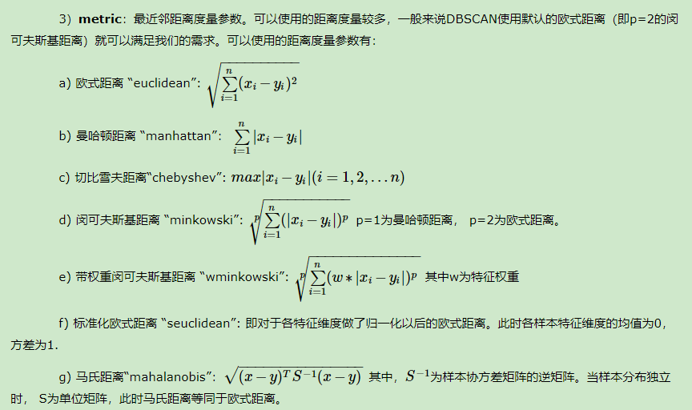

[toc]

### 1、聚类介绍

#### 1.1、聚类作用

* 知识发现 发现事物之间的潜在关系

* 异常值检测

* 特征提取 数据压缩的例子

#### 1.2、有监督与无监督学习

**有监督：**

* 给定训练集 X 和 标签Y 

* 选择模型
  * 学习（目标函数的最优化）
  * 生成模型（本质上是一组参数、方程）

根据生成的一组参数进行预测分类等任务

**无监督：**

* 拿到的数据只有X ，没有标签，只能根据X的相似程度做一些事情。

* Clustering 聚类
  * 对于大量未标注的数据集，按照内在相似性来分为多个类别（簇） 目标：类别内相似度大，类别间相似小。
  * 也可以用来改变数据的维度，可以将聚类结果作为一个维度添加到训练数据中。

* 降维算法，数据特征变少

#### 1.3、聚类算法


#### 1.4、相似度


#### 1.5、数据间的相似度

* 每一条数据都可以理解为多维空间中的一个点。

* 可以根据点和点之间的距离来评价数据间的相似度

* 近朱者赤近墨者黑！

欧氏距离：

* 二维空间：

$d = \sqrt{(x_1 - x_2)^2 + (y_1 - y_2)^2}$

* 三维空间：

$d = \sqrt{(x_1 - x_2)^2 + (y_1 - y_2)^2 + (z_1 - z_2)^2}$


* 闵可夫斯基距离

$d(X,Y) = \sqrt[p]{|x_1 - y_1|^p + |x_2 - y_2|^p + … + |x_n - y_n|^p}$


* P = 1 曼哈顿距离
  * $d(X,Y) = |x_1 - y_1| + |x_2 - y_2| + … + |x_n - y_n|$
  * 在二维空间中可以看出，这种距离是计算两点之间的直角边距离，相当于城市中出租汽车沿城市街道拐直角前进而不能走两点连接间的最短距离。

* P = 2 欧氏距离，就是两点之间的直线距离（以下简称欧氏距离）

* P = 无穷，切比雪夫距离 ，哪个维度差值最大就是那个差值作为距离。

  

  

#### 1.6、余弦距离

将数据看做空间中的点的时候，评价远近可以用欧氏距离或者余弦距离。

计算过程如下：

* 将数据映射为高维空间中的点（向量）
* 计算向量间的余弦值
* 取值范围[-1,+1] 越趋近于1代表越相似，越趋近于-1代表方向相反，0代表正交

<font size = 6 >$cos\theta = \frac{a \cdot b}{||a||_2||b||_2}$</font>

<font size = 6>$cos\theta = \frac{x_1x_2 + y_1y_2}{\sqrt{x_1^2 + y_1^2} \times \sqrt{x_2^2 + y_2^2}}$</font>


* 余弦相似度可以评价文章的相似度，从而实现对文章，进行分类。


### 2、K-means

#### 2.1、聚类原理

* 将N个样本映射到K个簇中

* 每个簇至少有一个样本

基本思路： 

* 先给定K个划分，迭代样本与簇的隶属关系，每次都比前一次好一些

* 迭代若干次就能得到比较好的结果


#### 2.2、K-means算法原理

算法步骤：

* 选择K个初始的簇中心 
  * 怎么选？

* 逐个计算每个样本到簇中心的距离，将样本归属到距离最小的那个簇中心的簇中

* 每个簇内部计算平均值，更新簇中心

* 开始迭代


聚类过程如下：


#### 2.3、K-Means优缺点

* 优点：
  * 简单，效果不错

* 缺点
  * 对异常值敏感
  * 对初始值敏感 
  * 对某些分布聚类效果不好

#### 2.4、K-means损失函数

<font size = 6>$\sum\limits_{i=0}^{n}\underset{\mu_j \in C}\min(||x_i - \mu_j||^2)$</font>

* 其中$\mu_j = \frac{1}{|C_j|}\sum\limits_{x \in C_j}x$ 是簇的均值向量，或者说是质心。

* 其中$||x_i - \mu_j||^2$代表每个样本点到均值点的距离（其实也是范数）。


#### 2.5、K-means执行过程


#### 2.6、K-means初步使用

亚洲国家队划分：

```Python
import numpy as np
import matplotlib.pyplot as plt
from sklearn.cluster import KMeans
import pandas as pd

# 需要将亚洲国家队，分成三个类别
# 只有历年的统计数据，没有目标值（类别，等级）
data = pd.read_csv('./AsiaFootball.txt')
data

# 执行多次，分类结果会有所不同
kmeans = KMeans(n_clusters=3)
# 无监督，只需要给数据X就可以
kmeans.fit(data.iloc[:,1:])
y_ = kmeans.predict(data.iloc[:,1:])# 聚类算法预测、划分的类别
c = data['国家'].values
for i in range(3):
    cond = y_ == i#索引条件
    print('类别是%d的国家有：'%(i),c[cond])
```


> ```
> 类别是0的国家有： ['中国' '伊拉克' '卡塔尔' '阿联酋' '泰国' '越南' '阿曼' '印尼']
> 类别是1的国家有： ['伊朗' '沙特' '乌兹别克斯坦' '巴林' '朝鲜']
> 类别是2的国家有： ['日本' '韩国']
> ```


#### 2.7、K-means聚类算法K值选择

**轮廓系数：**

针对某个样本的轮廓系数s为：<font size = 6>$ s= \frac{b - a}{max(a, b)}$</font>

- a：某个样本与其所在簇内其他样本的平均距离
- b：某个样本与其他簇样本的平均距离


聚类总的轮廓系数SC为：$SC = \frac{1}{N}\sum\limits_{i = 1}^Ns_i$，**所有样本的$s_i$的均值称为聚类结果的轮廓系数，是该聚类是否合理、有效的度量。**


```Python
import numpy as np
from sklearn import datasets
from sklearn.cluster import KMeans
import matplotlib.pyplot as plt
# 聚类：轮廓系数，对聚类的评价指标，对应数学公式
from sklearn.metrics import silhouette_score

# 创建数据
# 假数据，数据X划分成3类
X,y = datasets.make_blobs(centers=3,random_state=128)
plt.scatter(X[:,0],X[:,1],c = y)

# 指定不同的k，寻找最佳聚类类别数目
# 可以画图，一目了然，数据简单，属性只有两个，所以可以画图
# 属性多，无法可视化，评价指标
# 轮廓系数
plt.rcParams['font.sans-serif'] = 'KaiTi'
plt.rcParams['font.size'] = 18
plt.rcParams['axes.unicode_minus'] = False
score = []
for i in range(2,7):
    kmeans = KMeans(n_clusters=i)
    kmeans.fit(X)
    y_ = kmeans.predict(X)# 预测类别 == 标签
#     plt.scatter(X[:,0],X[:,1],c = y_)
    score.append(silhouette_score(X,y_))
#     print('当聚类类别是6的时候，评价指标轮廓系数： ',silhouette_score(X,y_))
plt.plot(range(2,7),score)
plt.xlabel('K值')
plt.ylabel('轮廓系数',c = 'red')
# 结论：，当k值是3的时候，轮廓系数最大，这个时候，说明划分效果最好！
```

效果图如下：（注意数据随机生成，数据展示的图片效果不是固定的~）


随着聚类数k的增大，样本划分会更加精细，每个簇的聚合程度会逐渐提高，那么误差平方和inertia\_自然会逐渐变小。并且，当k小于真实聚类数时，由于k的增大会**大幅**增加每个簇的聚合程度，故inertia\_的下降幅度会很大，而当k到达真实聚类数时，再增加k所得到的聚合程度回报会**迅速**变小，所以inertia\_的下降幅度会骤减，然后随着k值的继续增大而趋于平缓，也就是说inertia\_和k的关系图是一个**手肘**的形状，而这个肘部对应的k值就是数据的真实聚类数。当然，这也是该方法被称为手肘法的原因。


#### 2.8、K-means图像特征提取

```Python
import matplotlib.pyplot as plt # plt 用于显示图片
from sklearn.cluster import KMeans
import numpy as np
plt.figure(figsize=(8,4))

# 加载图片显示原图
pixel = plt.imread('bird.png')
plt.subplot(1,2,1)
plt.imshow(pixel)

# 聚类运算，压缩图片
pixel = pixel.reshape((128*128 , 3))
kmeans = KMeans(n_clusters=8).fit(pixel)

# 聚类结果合成新图片
newPixel = kmeans.cluster_centers_[kmeans.labels_].reshape(128,128,3)
plt.subplot(1,2,2)
plt.imshow(newPixel)
```


### 3、DBSCAN

#### 3.1、算法介绍

DBSCAN（Density-Based Spatial Clustering of Applications with Noise，具有噪声的基于密度的聚类方法）是一种基于密度的空间聚类算法。 该算法将具有足够密度的区域划分为簇，并在具有噪声的空间数据库中发现任意形状的簇，它将簇定义为密度相连的点的最大集合。


下面这些点是分布在样本空间的众多样本，现在我们的目标是把这些在样本空间中距离相近的聚成一类。我们发现A点附近的点密度较大，红色的圆圈根据一定的规则在这里滚啊滚，最终收纳了A附近的5个点，标记为红色也就是定为同一个簇。其它没有被收纳的根据一样的规则成簇。（形象来说，我们可以认为这是系统在众多样本点中随机选中一个，围绕这个被选中的样本点画一个圆，规定这个圆的半径以及圆内最少包含的样本点，如果在指定半径内有足够多的样本点在内，那么这个圆圈的圆心就转移到这个内部样本点，继续去圈附近其它的样本点，类似传销一样，继续去发展下线。等到这个滚来滚去的圈发现所圈住的样本点数量少于预先指定的值，就停止了。那么我们称最开始那个点为核心点，如A，停下来的那个点为边界点，如B、C，没得滚的那个点为离群点，如N）。


基于密度这点有什么好处呢，我们知道Kmeans聚类算法只能处理球形的簇，也就是一个聚成实心的团（这是因为算法本身计算平均距离的局限）。但往往现实中还会有各种形状，比如下面两张图，环形和不规则形，这个时候，那些传统的聚类算法显然就悲剧了。于是就思考，样本密度大的成一类呗。这就是DBSCAN聚类算法。


#### 3.2、DBSCAN算法原理


[网站动画解析](https://www.naftaliharris.com/blog/visualizing-dbscan-clustering/)


#### 3.3、DBSCAN参数解析

参数一eps：

DBSCAN算法参数，即我们的eps邻域的距离阈值，和样本距离超过eps的样本点不在eps邻域内。默认值是0.5.一般需要通过在多组值里面选择一个合适的阈值。eps过大，则更多的点会落在核心对象的eps邻域，此时我们的类别数可能会减少， 本来不应该是一类的样本也会被划为一类。反之则类别数可能会增大，本来是一类的样本却被划分开。


参数二min_samples：

DBSCAN算法参数，即样本点要成为核心对象所需要的eps邻域的样本数阈值。默认值是5。一般需要通过在多组值里面选择一个合适的阈值。通常和eps一起调参。在eps一定的情况下，min_samples过大，则核心对象会过少，此时簇内部分本来是一类的样本可能会被标为噪音点，类别数也会变多。反之min_samples过小的话，则会产生大量的核心对象，可能会导致类别数过少。


参数与三metrics：




#### 3.4、DBSCAN使用示例

```Python
import numpy as np
from sklearn import datasets
from sklearn.cluster import KMeans,DBSCAN
import matplotlib.pyplot as plt

# y中是两类：0,1
X,y = datasets.make_circles(n_samples=1000,noise=0.05,factor = 0.5)
# centers = [(1.5,1.5)] 元组，代表着，中心点的坐标值
# y1一类：0 + 2
X1,y1 = datasets.make_blobs(n_samples=500,n_features=2,centers=[(1.5,1.5)],cluster_std=0.2)

# 将circle和散点进行了数据合并
X = np.concatenate([X,X1])
y = np.concatenate([y,y1 + 2])
plt.scatter(X[:,0],X[:,1],c = y)
```


```Python
# 根据距离，划分‘势力范围’
kmeans = KMeans(3)
kmeans.fit(X)
y_ = kmeans.labels_
plt.scatter(X[:,0],X[:,1],c = y_)
```


```Python
dbscan = DBSCAN(eps = 0.2,min_samples=3)
dbscan.fit(X)
y_ = dbscan.labels_
plt.scatter(X[:,0],X[:,1],c = y_)
```


### 4、分层聚类

#### 4.1、算法介绍

分层聚类输出层次结构，这种结构比平面聚类返回的非结构化聚类集更具信息性。 

分层聚类法（hierarchical cluster method）一译“系统聚类法”。聚类分析的一种方法。其做法是开始时把每个样品作为一类，然后把最靠近的样品（即距离最小的群品）首先聚为小类，再将已聚合的小类按其类间距离再合并，不断继续下去，最后把一切子类都聚合到一个大类。


一般来说，当考虑聚类效率时，我们选择平面聚类，当平面聚类的潜在问题（不够结构化，预定数量的聚类，非确定性）成为关注点时，我们选择层次聚类。 此外，许多研究人员认为，层次聚类比平面聚类产生更好的聚类。


#### 4.2、算法原理

层次聚类(Hierarchical Clustering)是聚类算法的一种，通过计算不同类别数据点间的相似度来创建一棵有层次的嵌套聚类树。在聚类树中，不同类别的原始数据点是树的最低层，树的顶层是一个聚类的根节点。创建聚类树有自下而上合并和自上而下分裂两种方法。

我们着重看一下自底向上的合并算法：


两个组合数据点间的距离:

* Single Linkage
  * 方法是将两个组合数据点中距离最近的两个数据点间的距离作为这两个组合数据点的距离。这种方法容易受到极端值的影响。两个很相似的组合数据点可能由于其中的某个极端的数据点距离较近而组合在一起。
* Complete Linkage
  * complete Linkage的计算方法与Single Linkage相反，将两个组合数据点中距离最远的两个数据点间的距离作为这两个组合数据点的距离。Complete Linkage的问题也与Single Linkage相反，两个不相似的组合数据点可能由于其中的极端值距离较远而无法组合在一起。
* Average Linkage
  * Average Linkage的计算方法是计算两个组合数据点中的每个数据点与其他所有数据点的距离。将所有距离的均值作为两个组合数据点间的距离。这种方法计算量比较大，但结果比前两种方法更合理。
  * 我们使用Average Linkage计算组合数据点间的距离。下面是计算组合数据点(A,F)到(B,C)的距离，这里分别计算了(A,F)和(B,C)两两间距离的均值。
  * 

#### 4.3、参数介绍

* n_clusters 

  划分类别数目

* linkage

  度量两个子类的相似度时所依据的距离

  * **Single Linkage**：将两个数据点集中距离最近的两个数据点间的距离作为这两个点集的距离。
  * **Complete Linkage**：将两个点集中距离最远的两个数据点间的距离作为这两个点集的距离。
    上述两种方法容易受到极端值的影响，计算大样本集效率较高。
  * **Average Linkage**：计算两个点集中的每个数据点与其他所有数据点的距离。将所有距离的均值作为两个点集间的距离。这种方法计算量比较大，不过这种度量方法更合理
  * **Ward**：最小化簇内方差。

* connectivity

  连接性约束，作用：只有相邻的簇才能合并在一起，进行聚类！


#### 4.4、算法案例

导包

```Python
import numpy as np
import matplotlib.pyplot as plt
import mpl_toolkits.mplot3d.axes3d as p3
from sklearn.cluster import AgglomerativeClustering
from sklearn.datasets import make_swiss_roll
```

创建数据

```Python
X,y = datasets.make_swiss_roll(n_samples=1500,noise = 0.05)
fig = plt.figure(figsize=(12,9))
a3 = fig.add_subplot(projection = '3d')
a3.scatter(X[:,0],X[:,1],X[:,2],c = y)
a3.view_init(10,-80)
```


Kmeans聚类效果

```Python
# Kmeans只负责分类，随机性，类别是数字几，不固定
clf = KMeans(n_clusters=6)
clf.fit(X)
y_ = clf.labels_
fig = plt.figure(figsize=(12,9))
a3 = plt.subplot(projection = '3d')
a3.scatter(X[:,0],X[:,1],X[:,2],c = y_)
a3.view_init(10,-80)
```


分层聚类

```Python
agg = AgglomerativeClustering(n_clusters=6,linkage='ward')# 最近的距离，作为标准，
agg.fit(X)
y_ = agg.labels_
fig = plt.figure(figsize=(12,9))
a3 = plt.subplot(projection = '3d')
a3.scatter(X[:,0],X[:,1],X[:,2],c = y_)
a3.view_init(10,-80)
```


对于这种非欧几何的数据下，可见如果没有设置连接性约束，将会忽视其数据本身的结构，强制在欧式空间下聚类，于是很容易形成了上图这种跨越流形的不同褶皱。

分层聚类改进（连接性约束，对局部结构进行约束）

```Python
from sklearn.neighbors import kneighbors_graph# graph图形的意思
# 邻居数量变少，认为，条件宽松
conn = kneighbors_graph(X,n_neighbors=10) #采用邻居，进行约束
agg = AgglomerativeClustering(n_clusters=6,connectivity=conn,linkage='ward')# 最近的距离，作为标准，
agg.fit(X)
y_ = agg.labels_
fig = plt.figure(figsize=(12,9))
a3 = fig.add_subplot(projection = '3d')
a3.scatter(X[:,0],X[:,1],X[:,2],c = y_)
a3.view_init(10,-80)
```


