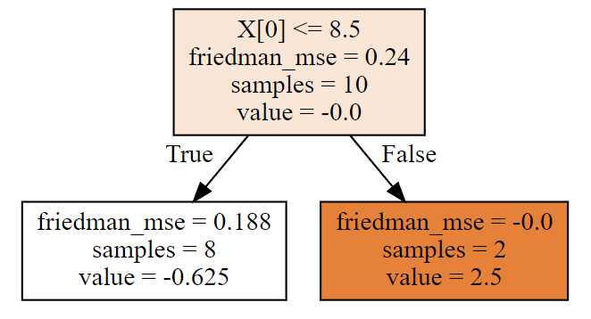
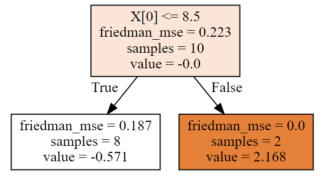
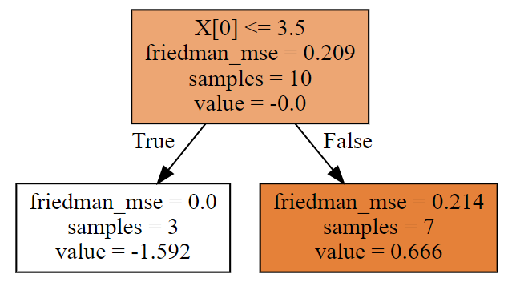

### 1、交叉熵

#### 1.1、信息熵

* 构建好一颗树，数据变的有顺序了（构建前，一堆数据，杂乱无章；构建一颗，整整齐齐，顺序），用什么度量衡表示，数据是否有顺序：信息熵

* 物理学，热力学第二定律（熵），描述的是封闭系统的混乱程度

  

  

* 信息熵，和物理学中熵类似的

  

* <font size = 5>$H(x) = -\sum\limits_{i = 1}^n p(x)log_2p(x)$</font>

* <font size = 5>$H(x) = \sum\limits_{i = 1}^n p(x)log_2\frac{1}{p(x)}$​</font>

#### 1.2、交叉熵

由**信息熵**可以引出**交叉熵**！

小明在学校玩王者荣耀被发现了，爸爸被叫去开家长会，心里悲屈的很，就想法子惩罚小明。到家后，爸爸跟小明说：既然你犯错了，就要接受惩罚，但惩罚的程度就看你聪不聪明了。这样吧，我们俩玩猜球游戏，我拿一个球，你猜球的颜色，我可以回答你任何问题，你每猜一次，不管对错，你就一个星期不能玩王者荣耀，当然，猜对，游戏停止，否则继续猜。**当然，当答案只剩下两种选择时，此次猜测结束后，无论猜对猜错都能100%确定答案，无需再猜一次，此时游戏停止。**

##### 1.2.1、题目一

爸爸拿来一个箱子，跟小明说：里面有**橙、紫、蓝及青**四种颜色的小球任意个，各颜色小球的占比不清楚，现在我从中拿出一个小球，你猜我手中的小球是什么颜色？

为了使被罚时间最短，小明发挥出最强王者的智商，瞬间就想到了以最小的代价猜出答案，简称策略1，小明的想法是这样的。


在这种情况下，小明什么信息都不知道，只能认为四种颜色的小球出现的概率是一样的。所以，根据策略1，1/4概率是橙色球，小明需要猜两次，1/4是紫色球，小明需要猜两次，其余的小球类似，所以小明预期的猜球次数为：

<font size = 5>$\rm H = \frac{1}{4} * 2 + \frac{1}{4} * 2 +\frac{1}{4} * 2 +\frac{1}{4} * 2 = 2$​​</font>


##### 1.2.2、题目二

爸爸还是拿来一个箱子，跟小明说：箱子里面有小球任意个，但其中1/2是橙色球，1/4是紫色球，1/8是蓝色球及1/8是青色球。我从中拿出一个球，你猜我手中的球是什么颜色的？

小明毕竟是最强王者，仍然很快得想到了答案，简称策略2，他的答案是这样的。


在这种情况下，小明知道了每种颜色小球的比例，比如橙色占比二分之一，如果我猜橙色，很有可能第一次就猜中了。所以，根据策略2，1/2的概率是橙色球，小明需要猜一次，1/4的概率是紫色球，小明需要猜两次，1/8的概率是蓝色球，小明需要猜三次，1/8的概率是青色球，小明需要猜三次，所以小明猜题次数的期望为：

<font size = 5>$\rm H = \frac{1}{2} * 1 + \frac{1}{4} * 2 +\frac{1}{8} * 3 +\frac{1}{8} * 3 = 1.75$​​</font>

##### 1.2.3、题目三

其实，爸爸只想让小明意识到自己的错误，并不是真的想罚他，所以拿来一个箱子，跟小明说：里面的球都是橙色，现在我从中拿出一个，你猜我手中的球是什么颜色？

最强王者怎么可能不知道，肯定是橙色，小明需要猜0次。


上面三个题目表现出这样一种现象：针对特定概率为p的小球，需要猜球的次数 = $\rm log_2\frac{1}{p}$ ，例如题目2中，1/4是紫色球， $\rm log_24$  = 2 次；1/8是蓝色球， $\rm log_28$= 3次，这叫做一个事件的自信息（self-information）。那么，针对整个系统，有多种可能发生的事件，预期的猜题次数为: $\rm\sum\limits_{k = 1}^Np_klog_2\frac{1}{p_k}$ ，这就是**信息熵，**上面三个题目的预期猜球次数都是由这个公式计算而来，第一题的信息熵为2，第二题的信息熵为1.75，最三题的信息熵为$\rm H = 1 * log_2(1) = 0$

**信息熵代表的是随机变量或整个系统的不确定性，熵越大，随机变量或系统的不确定性就越大。**上面题目1的熵 > 题目2的熵 > 题目3的熵。在题目1中，小明对整个系统一无所知，只能假设所有的情况出现的概率都是均等的，此时的熵是最大的。题目2中，小明知道了橙色小球出现的概率是1/2及其他小球各自出现的概率，说明小明对这个系统有一定的了解，所以系统的不确定性自然会降低，所以熵小于2。题目3中，小明已经知道箱子中肯定是橙色球，爸爸手中的球肯定是橙色的，因而整个系统的不确定性为0，也就是熵为0。所以，在什么都不知道的情况下，熵会最大，针对上面的题目1~题目3，这个最大值是2，除此之外，其余的任何一种情况，熵都会比2小。


所以，每一个系统都会有一个真实的概率分布，也叫真实分布，题目1的真实分布为（1/4，1/4，1/4，1/4），题目2的真实分布为（1/2，1/4，1/8，1/8），而**根据真实分布，我们能够找到一个最优策略，以最小的代价消除系统的不确定性**，**而这个代价大小就是信息熵，记住，信息熵衡量了系统的不确定性，而我们要消除这个不确定性，所要付出的【最小努力】（猜题次数、编码长度等）的大小就是信息熵**。具体来讲，题目1只需要猜两次就能确定任何一个小球的颜色，题目2只需要猜测1.75次就能确定任何一个小球的颜色。


现在回到题目2，假设小明只是钻石段位而已，智商没王者那么高，他使用了策略1，即


爸爸已经告诉小明这些小球的真实分布是（1/2，1/4, 1/8，1/8），但小明所选择的策略却认为所有的小球出现的概率相同，相当于忽略了爸爸告诉小明关于箱子中各小球的真实分布，而仍旧认为所有小球出现的概率是一样的，认为小球的分布为（1/4，1/4，1/4，1/4），这个分布就是**非真实分布**。此时，小明猜中任何一种颜色的小球都需要猜两次，即1/2 * 2 + 1/4 * 2 + 1/8 * 2 + 1/8 * 2 = 2。

很明显，针对题目2，使用策略1是一个**坏**的选择，因为需要猜题的次数增加了，从1.75变成了2。因此，当我们知道根据系统的真实分布制定最优策略去消除系统的不确定性时，我们所付出的努力是最小的，但并不是每个人都和最强王者一样聪明，我们也许会使用其他的策略（非真实分布）去消除系统的不确定性，就好比如我将策略1用于题目2（原来这就是我在白银的原因），那么，当我们使用非最优策略消除系统的不确定性，所需要付出的努力的大小我们该如何去衡量呢？

这就需要引入**交叉熵，其用来衡量在给定的真实分布下，使用非真实分布所指定的策略消除系统的不确定性所需要付出的努力的大小**。

##### 1.2.4、交叉熵

正式的讲，交叉熵的公式为：<font size = 5>$\rm\sum\limits_{k = 1}^Np_klog_2\frac{1}{q_k}$ </font>  ，其中 $p_k$ 表示真实分布， $q_k$ 表示非真实分布。例如上面所讲的将策略1用于题目2，真实分布<font size =5>$p_k = (\frac{1}{2},\frac{1}{4},\frac{1}{8},\frac{1}{8})$</font>  ， 非真实分布<font size =5>$q_k = (\frac{1}{4},\frac{1}{4},\frac{1}{4},\frac{1}{4})$</font>  ，

交叉熵为<font size = 5>$\rm \frac{1}{2}*log_24 + \frac{1}{4}*log_24 + \frac{1}{8}*log_24 + \frac{1}{8}*log_24 = 2$ </font> ，比最优策略的1.75大一些！

因此，**交叉熵越低**，这个**策略就越好**，最低的交叉熵也就是使用了真实分布所计算出来的信息熵，因为此时 ![[公式]](https://www.zhihu.com/equation?tex=p_k+%3D+q_k) ，交叉熵 = 信息熵。这也是为什么在机器学习中的分类算法中，我们总是最小化交叉熵，因为交叉熵越低，就证明由算法所产生的策略最接近最优策略，也间接证明我们算法所算出的非真实分布越接近真实分布。


#### 1.3、sigmoid

<font size = 6>$f(x) = \frac{1}{1 + e^{-x}}$​​​</font>


<font size = 6>$f'(x) = \frac{e^{-x}}{(1 + e^{-x})^2} =f(x) * \frac{1 + e^{-x} - 1}{1 + e^{-x}} = f(x) * (1 - f(x))$</font>

后面算法推导过程中都会使用到上面的基本方程，因此先对以上概念公式，有基本了解！


### 2、GBDT分类树

#### 2.1、梯度提升分类树概述

GBDT分类树 sigmoid + 决策回归树 ------------> 概率问题！

* 损失函数是交叉熵
* 概率计算使用sigmoid
* 使用mse作为分裂标准（同梯度提升回归树）

#### 2.2、梯度提升分类树应用

1、加载数据

```Python
import numpy as np
from sklearn import datasets
from sklearn.model_selection import train_test_split
from sklearn.ensemble import GradientBoostingClassifier
from sklearn.tree import DecisionTreeClassifier

X,y = datasets.load_iris(return_X_y = True)
X_train,X_test,y_train,y_test = train_test_split(X,y,random_state = 1124)
```

2、普通决策树表现

```Python
model = DecisionTreeClassifier()
model.fit(X_train,y_train)
model.score(X_test,y_test)
# 输出：0.868421052631579
```

3、梯度提升分类树表现

```Python
clf = GradientBoostingClassifier(subsample=0.8,learning_rate = 0.005)
clf.fit(X_train,y_train)
clf.score(X_test,y_test)
# 输出：0.9473684210526315
```


### 3、GBDT分类树算例演示

#### 3.1、算法公式

* 概率计算（sigmoid函数）

  

  <font size = 6>$p = \frac{1}{1 + exp(-F(x))}$​​</font>

  

* 函数初始值（这个函数即是sigmoid分母中的 F(x)，用于计算概率）

  逻辑回归中的函数是线性函数，GBDT 中的函数**不是**线性函数，但是作用类似！

  

  <font size = 6>$F_0(x) = log\frac{\sum\limits_{i=1}^Ny_i}{\sum\limits_{i=1}^N(1 -y_i)}$​​​​​</font>

  

* 计算残差公式

  

  <font size = 6>$\rm residual = \widetilde{y}= y - \frac{1}{1+exp(-F(x))}$ </font>

  

* 均方误差（根据均方误差，筛选最佳裂分条件）

  <font size = 6>$\rm mse = ((residual - residual.mean())^2).mean()$</font>

* 决策树叶节点预测值（相当于负梯度）

  <font size = 6>$\gamma_{mj} = \frac{\sum\limits_{x_i \in R_{mj}}\widetilde{y}_i}{\sum\limits_{x_i \in R_{mj}}(y_i - \widetilde{y}_i)(1 - y_i + \widetilde{y}_i)}$​​​​</font>

* 梯度提升

  

  <font size = 6>$F_1 = F_0 + \gamma * learning\_rate$</font>


根据以上公式，即可进行代码演算了~


#### 3.2、算例演示

##### 3.2.1、创建数据

```Python
import numpy as np
from sklearn.ensemble import GradientBoostingClassifier
from sklearn import tree
import graphviz
X = np.arange(1,11).reshape(-1,1)
y = np.array([0,0,0,1,1]*2)
display(X,y)
```

##### 3.2.2、构造GBDT训练预测

```Python
# 默认情况下，损失函数就是Log-loss == 交叉熵！
clf = GradientBoostingClassifier(n_estimators=3,learning_rate=0.1,max_depth=1)
clf.fit(X,y)
y_ = clf.predict(X)
print('真实的类别：',y)
print('算法的预测：',y_)

proba_ = clf.predict_proba(X)
print('预测概率是：\n',proba_)
# 输出
'''
真实的类别： [0 0 0 1 1 0 0 0 1 1]
算法的预测： [0 0 0 0 0 0 0 0 1 1]
预测概率是：
 [[0.66466915 0.33533085]
 [0.66466915 0.33533085]
 [0.66466915 0.33533085]
 [0.6126304  0.3873696 ]
 [0.6126304  0.3873696 ]
 [0.6126304  0.3873696 ]
 [0.6126304  0.3873696 ]
 [0.6126304  0.3873696 ]
 [0.46804618 0.53195382]
 [0.46804618 0.53195382]]
'''
```

##### 3.2.3、GBDT可视化

第一棵树

```Python
dot_data = tree.export_graphviz(clf[0,0],filled = True)
graph = graphviz.Source(dot_data)
graph
```



第二棵树

```Python
dot_data = tree.export_graphviz(clf[1,0],filled = True)
graph = graphviz.Source(dot_data)
graph
```



第三棵树

```Python
dot_data = tree.export_graphviz(clf[2,0],filled = True)
graph = graphviz.Source(dot_data)
graph
```



每棵树，根据属性进行了划分，每棵树的叶节点都有预测值，这些具体都是如何计算的呢？且看，下面详细的计算工程~


##### 3.2.4、计算步骤

首先，计算初始值

$F_0(x)= log\frac{\sum\limits_{i=1}^Ny_i}{\sum\limits_{i=1}^N(1 -y_i)}$

```Python
F0 = np.log(y.sum()/(1-y).sum())
F0
# 输出结果：-0.40546510810816444
```

此时未裂分，所有的数据都是F0

```Python
F0 = np.array([F0]*10)
F0
```

然后，计算残差

<font size = 6>$residual = \widetilde{y}= y - \frac{1}{1+exp(-F(x))}$ </font>

```Python
# 残差，F0带入sigmoid计算的即是初始概率
residual0 = y - 1/(1 + np.exp(-F0))
residual0
# 输出：array([-0.4, -0.4, -0.4,  0.6,  0.6, -0.4, -0.4, -0.4,  0.6,  0.6])
```

接下来，我们根据上面的计算结果，进行每一棵树的计算！

##### 3.2.5、拟合第一棵树

根据残差的mse，计算最佳分裂条件

<font size = 6>$mse = ((residual - residual.mean())^2).mean()$</font>

```Python
lower_mse = ((residual0 - residual0.mean())**2).mean()
best_split = {}
# 分裂标准 mse
for i in range(0,10):
    if i == 9:
        mse = ((residual0 - residual0.mean())**2).mean()
    else:
        left_mse = ((residual0[:i+1] - residual0[:i+1].mean())**2).mean()
        right_mse = ((residual0[i+1:] - residual0[i+1:].mean())**2).mean()
        mse = left_mse*(i+1)/10 + right_mse*(10-i-1)/10
    if lower_mse > mse:
        lower_mse = mse
        best_split.clear()
        best_split['X[0] <= '] = X[i:i + 2].mean() 
    print('从第%d个进行分裂'%(i + 1),np.round(mse,4))
# 从第八个样本这里进行分类，最优的选择，和算法第一颗画图的结果一致
print('最小的mse是：',lower_mse)
print('最佳裂分条件是：',best_split)
# 输出
'''
从第1个进行分裂 0.2222
从第2个进行分裂 0.2
从第3个进行分裂 0.1714
从第4个进行分裂 0.225
从第5个进行分裂 0.24
从第6个进行分裂 0.2333
从第7个进行分裂 0.2095
从第8个进行分裂 0.15
从第9个进行分裂 0.2
从第10个进行分裂 0.24
最小的mse是： 0.15
最佳裂分条件是： {'X[0] <= ': 8.5}
'''
```

现在我们知道了，分裂条件是：X[0] <= 8.5！然后计算决策树叶节点预测值（相当于负梯度），其中的 $\widetilde {y}_i$​ 就是​​残差residual0

<font size = 6>$\gamma_{mj} = \frac{\sum\limits_{x_i \in R_{mj}}\widetilde{y}_i}{\sum_\limits{x_i \in R_{mj}}(y_i - \widetilde{y}_i)(1 - y_i + \widetilde{y}_i)}$​​​</font>

```Python
# 前八个是一类
# 后两个是一类
# 左边分支
gamma1 = residual0[:8].sum()/((y[:8] - residual0[:8])*(1 - y[:8] + residual0[:8])).sum()
print('左边决策树分支，预测值：',gamma1)

# 右边分支
gamma2 =residual0[8:].sum()/((y[8:] - residual0[8:])*(1 - y[8:] + residual0[8:])).sum()
print('右边决策树分支，预测值：',gamma2)
# 输出：
'''
左边决策树分支，预测值： -0.6250000000000001
右边决策树分支，预测值： 2.5
'''
```

结论：

第一棵树就拟合完成了，自己计算的，和算法中的第一棵树（画图显示），完全一样！

##### 3.2.6、拟合第二棵树

第一棵树的负梯度（预测值）

```Python
# 第一棵预测的结果,负梯度
gamma = np.array([gamma1]*8 + [gamma2]*2)
gamma
# 输出：
'''
array([-0.625, -0.625, -0.625, -0.625, -0.625, -0.625, -0.625, -0.625,
        2.5  ,  2.5  ])
'''
```

梯度提升

<font size = 6>$F_1 = F_0 + \gamma * learning\_rate$​</font>

```Python
# F(x) 随着梯度提升树，提升，发生变化
learning_rate = 0.1
F1 = F0 + gamma*learning_rate
F1
# 输出
'''
array([-0.46796511, -0.46796511, -0.46796511, -0.46796511, -0.46796511,
       -0.46796511, -0.46796511, -0.46796511, -0.15546511, -0.15546511])
'''
```

根据 F1 计算残差

<font size = 6>$residual = \widetilde{y}= y - \frac{1}{1+exp(-F(x))}$​ </font>

```Python
residual1 = y - 1/(1 + np.exp(-F1))
residual1
# 输出
'''
array([-0.38509799, -0.38509799, -0.38509799,  0.61490201,  0.61490201,
       -0.38509799, -0.38509799, -0.38509799,  0.53878818,  0.53878818])
'''
```

根据新的残差residual1的mse，计算最佳分裂条件

```Python
lower_mse = ((residual1 - residual1.mean())**2).mean()
best_split = {}
# 分裂标准 mse
for i in range(0,10):
    if i == 9:
        mse = ((residual1 - residual1.mean())**2).mean()
    else:
        left_mse = ((residual1[:i+1] - residual1[:i+1].mean())**2).mean()
        right_mse = ((residual1[i+1:] - residual1[i+1:].mean())**2).mean()
        mse = left_mse*(i+1)/10 + right_mse*(10-i-1)/10
    if lower_mse > mse:
        lower_mse = mse
        best_split.clear()
        best_split['X[0] <= '] = X[i:i + 2].mean() 
    print('从第%d个进行分裂'%(i + 1),np.round(mse,4))
# 从第八个样本这里进行分类，最优的选择，和算法第一颗画图的结果一致
print('最小的mse是：',lower_mse)
print('最佳裂分条件是：',best_split)
# 输出
'''
从第1个进行分裂 0.2062
从第2个进行分裂 0.1856
从第3个进行分裂 0.1592
从第4个进行分裂 0.2105
从第5个进行分裂 0.2224
从第6个进行分裂 0.2187
从第7个进行分裂 0.1998
从第8个进行分裂 0.15
从第9个进行分裂 0.1904
从第10个进行分裂 0.2227
最小的mse是： 0.15
最佳裂分条件是： {'X[0] <= ': 8.5}
'''
```

现在我们知道了，第二棵树分裂条件是：X[0] <= 8.5！然后计算决策树叶节点预测值（相当于负梯度），其中的 $\widetilde {y}_i$​​ 就是​​残差residual1

<font size = 6>$\gamma_{mj} = \frac{\sum\limits_{x_i \in R_{mj}}\widetilde{y}_i}{\sum_\limits{x_i \in R_{mj}}(y_i - \widetilde{y}_i)(1 - y_i + \widetilde{y}_i)}$</font>

```Python
# 计算第二棵树的预测值
# 前八个是一类
# 后两个是一类
# 左边分支
gamma1 = residual1[:8].sum()/((y[:8] - residual1[:8])*(1 - y[:8] + residual1[:8])).sum()
print('第二棵树左边决策树分支，预测值：',gamma1)

# 右边分支
gamma2 =residual1[8:].sum()/((y[8:] - residual1[8:])*(1 - y[8:] + residual1[8:])).sum()
print('第二棵树右边决策树分支，预测值：',gamma2)
# 输出
'''
第二棵树左边决策树分支，预测值： -0.5705211093125406
第二棵树右边决策树分支，预测值： 2.1682011746071073
'''
```

结论：

第二棵树就拟合完成了，自己计算的，和算法中的第二棵树（画图显示），完全一样！


##### 3.2.7、拟合第三棵树

第二棵树的负梯度

```Python
# 第二棵树预测值
gamma = np.array([gamma1]*8 + [gamma2]*2)
gamma
# 输出
'''
array([-0.57052111, -0.57052111, -0.57052111, -0.57052111, -0.57052111,
       -0.57052111, -0.57052111, -0.57052111,  2.16820117,  2.16820117])
'''
```

梯度提升

<font size = 6>$F_1 = F_0 + \gamma * learning\_rate$​</font>

```Python
# F(x) 随着梯度提升树，提升，发生变化
learning_rate = 0.1
F2 = F1 + gamma*learning_rate 
F2
# 输出
'''
array([-0.52501722, -0.52501722, -0.52501722, -0.52501722, -0.52501722,
       -0.52501722, -0.52501722, -0.52501722,  0.06135501,  0.06135501])
'''
```

根据 F2 计算残差

<font size = 6>$residual = \widetilde{y}= y - \frac{1}{1+exp(-F(x))}$​​ </font>

```Python
residual2 = y - 1/(1 + np.exp(-F2))
residual2
# 输出
'''
array([-0.37167979, -0.37167979, -0.37167979,  0.62832021,  0.62832021,
       -0.37167979, -0.37167979, -0.37167979,  0.48466606,  0.48466606])
'''
```

根据新的残差residual2的mse，计算最佳分裂条件

```Python
lower_mse = ((residual2 - residual2.mean())**2).mean()
best_split = {}
# 分裂标准 mse
for i in range(0,10):
    if i == 9:
        mse = ((residual2 - residual2.mean())**2).mean()
    else:
        left_mse = ((residual2[:i+1] - residual2[:i+1].mean())**2).mean()
        right_mse = ((residual2[i+1:] - residual2[i+1:].mean())**2).mean()
        mse = left_mse*(i+1)/10 + right_mse*(10-i-1)/10
    if lower_mse > mse:
        lower_mse = mse
        best_split.clear()
        best_split['X[0] <= '] = X[i:i + 2].mean() 
    print('从第%d个进行分裂'%(i + 1),np.round(mse,4))
# 从第八个样本这里进行分类，最优的选择，和算法第一颗画图的结果一致
print('最小的mse是：',lower_mse)
print('最佳裂分条件是：',best_split)
# 输出
'''
从第1个进行分裂 0.1935
从第2个进行分裂 0.1744
从第3个进行分裂 0.1498
从第4个进行分裂 0.199
从第5个进行分裂 0.208
从第6个进行分裂 0.2067
从第7个进行分裂 0.1917
从第8个进行分裂 0.15
从第9个进行分裂 0.1827
从第10个进行分裂 0.2088
最小的mse是： 0.1497502190152274
最佳裂分条件是： {'X[0] <= ': 3.5}
'''
```

现在我们知道了，第三棵树分裂条件是：X[0] <= 3.5！然后计算决策树叶节点预测值（相当于负梯度），其中的 $\widetilde {y}_i$​​​ 就是​​残差residual2

<font size = 6>$\gamma_{mj} = \frac{\sum\limits_{x_i \in R_{mj}}\widetilde{y}_i}{\sum_\limits{x_i \in R_{mj}}(y_i - \widetilde{y}_i)(1 - y_i + \widetilde{y}_i)}$</font>

```Python
#  计算第三颗树的预测值
# 前三个是一类
# 后七个是一类
# 左边分支
gamma1 = residual2[:3].sum()/((y[:3] - residual2[:3])*(1 - y[:3] + residual2[:3])).sum()
print('第三棵树左边决策树分支，预测值：',gamma1)

# 右边分支
gamma2 =residual2[3:].sum()/((y[3:] - residual2[3:])*(1 - y[3:] + residual2[3:])).sum()
print('第三棵树右边决策树分支，预测值：',gamma2)
# 输出
'''
第三棵树左边决策树分支，预测值： -1.591545178439374
第三棵树右边决策树分支，预测值： 0.6663469228422207
'''
```

结论：

第三棵树就拟合完成了，自己计算的，和算法中的第三棵树（画图显示），完全一样！


##### 3.2.8、预测概率计算


计算第三棵树的F3(x)

```Python
# 计算第三棵的F3(x)
# 第三棵树预测值
gamma = np.array([gamma1]*3 + [gamma2]*7)
# F(x) 随着梯度提升树，提升，发生变化
learning_rate = 0.1
F3 = F2 + gamma*learning_rate
F3
# 输出
'''
array([-0.68417174, -0.68417174, -0.68417174, -0.45838253, -0.45838253,
       -0.45838253, -0.45838253, -0.45838253,  0.1279897 ,  0.1279897 ])
'''
```

概率公式如下：

<font size = 6>$p = \frac{1}{1 + exp(-F(x))}$</font>

```Python
proba = 1/(1 + np.exp(-F3))
# 类别：0,1，如果这个概率大于等于0.5类别1，小于0.5类别0
display(proba)
# 进行转换，类别0,1的概率都展示
np.column_stack([1- proba,proba])
# 输出
'''
array([0.33533085, 0.33533085, 0.33533085, 0.3873696 , 0.3873696 ,
       0.3873696 , 0.3873696 , 0.3873696 , 0.53195382, 0.53195382])
array([[0.66466915, 0.33533085],
       [0.66466915, 0.33533085],
       [0.66466915, 0.33533085],
       [0.6126304 , 0.3873696 ],
       [0.6126304 , 0.3873696 ],
       [0.6126304 , 0.3873696 ],
       [0.6126304 , 0.3873696 ],
       [0.6126304 , 0.3873696 ],
       [0.46804618, 0.53195382],
       [0.46804618, 0.53195382]])
'''
```

算法预测概率

```Python
clf.predict_proba(X)
# 输出
'''
array([[0.66466915, 0.33533085],
       [0.66466915, 0.33533085],
       [0.66466915, 0.33533085],
       [0.6126304 , 0.3873696 ],
       [0.6126304 , 0.3873696 ],
       [0.6126304 , 0.3873696 ],
       [0.6126304 , 0.3873696 ],
       [0.6126304 , 0.3873696 ],
       [0.46804618, 0.53195382],
       [0.46804618, 0.53195382]])
'''
```

结论：

* 手动计算的概率和算法预测的概率完全一样！

* GBDT分类树，计算过程原理如上

### 4、GBDT分类树原理推导

#### 4.1、损失函数：

* 定义交叉熵为函数<font size = 5>$\psi(y,F(x))$</font>

* <font size = 5>$\psi(y,F(x)) = -yln(p) - (1-y)ln(1-p)$</font>

  * 其中<font size = 5>$p = \frac{1}{1 + exp(-F(x))}$​</font> ，即sigmoid函数
  * gamma​​​ 表示决策回归树 DecisionTreeRegressor F(x) 表示每一轮决策树的value，即负梯度
  * $F_m(x) = F_{m-1}(x) + learning\_rate \times gamma$

#### 4.2、损失函数化简

* 损失函数化简：

* $\psi(y,F(x)) = -yF(x) + ln(1 + exp(F(x)))$​

* [化简过程](https://blog.csdn.net/Soft_Po/article/details/119208209)

#### 4.3、损失函数求导

将F(x)看成整体变量，进行求导

一阶导数：

$\begin{aligned}\psi'(y,F(x)) & = -y + \frac{exp(F(x))}{1 + exp(F(x))}\\\\&=-y + \frac{1}{1 + exp(-F(x))}\\\\&= -y + \sigma(F(x))\end{aligned}$​​​​​ 

 令$\sigma(F(x)) = \frac{1}{1 + exp(-F(x))}$​​ ，$\sigma(F(x))$ 表示sigmoid函数​​

二阶导数

* $\psi''(y,F(x)) = \sigma(F(x))(1 - \sigma(F(x)))$​


#### 4.4、初始值 $F_0(x)$​​​ 计算

<font color = green size = 6>$F_0(x) = log\frac{\sum\limits_{i=1}^Ny_i}{\sum\limits_{i=1}^N(1 -y_i)}$</font>

##### 4.4.1、初始值方程构建

之前的回归树计算MSE时，初始值是多少：<font color =red>平均值</font>

<font size = 5>$\text{MSE}(y, \hat{y}) = \frac{1}{n_\text{samples}} \sum\limits_{i=0}^{n_\text{samples} - 1} (y_i - \hat{y}_i)^2$</font>

现在的GBDT分类树 ，计算初始值 $F_0(x)$​ ，令$\rho = F_0(x)$​

$\begin{aligned}F_0(x) &= {argmin}_{\rho}\sum\limits_{i = 1}^N\psi(y_i,\rho)\\\\&=argmin_{\rho}\sum\limits_{i=1}^N(-y_i\rho +ln(1 + exp(\rho)))\end{aligned}$​

  * $\psi(y,\rho)$ ​为整体的损失函数，交叉熵
  * $\psi'(y,\rho) = -\sum\limits_{i = 1}^N(y_i - \sigma(\rho))$​
  * $\psi'(y,\rho) = -\sum\limits_{i = 1}^N(y_i - \frac{1}{1 + exp(-\rho)})$​
##### 4.4.2、令$\psi'(y,\rho) = 0$​​
  * $0 = -\sum\limits_{i = 1}^N(y_i -\frac{1}{1 + exp(-\rho)})$
  * $0 = \sum\limits_{i = 1}^N(y_i -\frac{1}{1 + exp(-\rho)})$
  * 移动方程中一项，转移到方程左边了
  * $\sum\limits_{i=1}^Ny_i = \sum\limits_{i=1}^N\frac{1}{1+exp(-\rho)}$

##### 4.4.3、$exp(\rho)$​ 为常数，所以：
  * <font color = red size = 5>$\sum\limits_{i=1}^Ny_i = \frac{N}{1+exp(-\rho)}$​</font>
  * 求倒数
  * <font color = green size = 5>$\frac{(1 + exp(-\rho))}{N} = \frac{1}{\sum\limits_{i=1}^Ny_i}$​</font>
  * $1 + exp(-\rho) = \frac{N}{\sum\limits_{i=1}^Ny_i}$

  

  * $1 + exp(-\rho) = \frac{\sum\limits_{i=1}^N1}{\sum\limits_{i=1}^Ny_i}$

  * $exp(-\rho) = \frac{\sum\limits_{i=1}^N1}{\sum\limits_{i=1}^Ny_i} - 1$

##### 4.4.4、将1变换到分子上
  * <font color = red size = 5>$exp(-\rho) = \frac{\sum\limits_{i=1}^N(1 -y_i)}{\sum\limits_{i=1}^Ny_i}$​</font>
  * 幂运算

  * $-\rho = ln\frac{\sum\limits_{i=1}^N(1 -y_i)}{\sum\limits_{i=1}^Ny_i}$

##### 4.4.5、负号移动到对数运算中，分子和分母对调
  * <font color = green size = 6>$\rho = ln\frac{\sum\limits_{i=1}^Ny_i}{\sum\limits_{i=1}^N(1 -y_i)}$​​​</font>
  * <font color = green size = 6>$F_0(x) = ln\frac{\sum\limits_{i=1}^Ny_i}{\sum\limits_{i=1}^N(1 -y_i)}$</font>

#### 4.5、决策树叶节点 $\gamma_{mj}$​​​ 预测值


<font size = 15 color = green>$\gamma_{mj} = \frac{\sum\limits_{x_i \in R_{mj}}\widetilde{y_i}}{\sum\limits_{x_i \in R_{mj}}(y_i - \widetilde{y_i})(1 - y_i + \widetilde{y_i})}$</font>


##### 4.5.1、定义损失函数

在第m轮的学习中，决策树的第j个叶子节点预测值 $\gamma_{mj}$​​​ 计算的公式推导:

* $$\gamma_{mj}$$​ 相当于函数 F(x) 进行梯度下降中的梯度
* $F_m(x) = F_{m-1}(x) + \gamma_m*learning\_rate$​
* $learning\_rate$ 是学习率，是一个常量，可忽略

定义损失函数$L(\gamma_{mj,R_{mj}})$​

<font size = 5>$L(\gamma_{mj},R_{mj}) = \sum\limits_{x_i \in R_{mj}}\psi(y,F_{m-1}(x) + \gamma_{mj})$</font>

* $F_{m-1}(x)$ 表示上一棵树的函数值
* 其中叶节点的区域为 $R_{mj} $​​  参数说明： $j = 1,2,3,……,j_m$​​ ， $j_m$​​​ 为第m颗决策树叶子节点的个数。


##### 4.5.2、二阶泰勒展开公式

上面损失函数比较复杂，很难优化（无法通过求导，令导数为零，进行计算），下面我们利用二阶泰勒展开式（重要的方程求解近似公式）近似求解：

<font size = 4 color = red>$L(\gamma_{mj},R_{mj}) \approx \sum\limits_{x_i \in R_{mj}}\{\psi(y,F_{m-1}(x)) + \psi'(y,F_{m-1}(x))\gamma_{mj} + \frac{1}{2}\psi''(y,F_{m-1}(x))\gamma_{mj}^2 \}$​​</font>

若函数$f(x)$ 在包含 $x_0$ 的某个开区间 $(a,b)$ 上具有 $(n +1)$ 阶导数，那么对于任意 $x \in (a,b)$，有：

$f(x) = \frac{f(x_0)}{0!} + \frac{f'(x_0)}{1!}(x - x_0) + \frac{f''(x_0)}{2!}(x-x_0)^2 + \cdot \cdot\cdot + \frac{f^{(n+1)}(x_0)}{(n+1)!}(x-x_0)^{n+1}$​​

**0！= 1** 可以看做是对于如下规律的完整：

* 5! = 6!/6

* 4! = 5!/5

- 3! = 4!/4

- 2! = 3!/3

+ 1! = 2!/2

* <font color =  'green'>0! = 1!/1 = 1</font>


方程变形：

$f(x) = f(x_0 + (x - x_0))$​ 其中 $(x - x_0)$​​ 表示一个微小的差值，可以使用$\Delta x$​​ 表示

$\begin{aligned}f(x_0 + (x - x_0)) &= \frac{f(x_0)}{0!} + \frac{f'(x_0)}{1!}(x - x_0) + \frac{f''(x_0)}{2!}(x-x_0)^2 + \cdot \cdot\cdot + \frac{f^{(n+1)}(x_0)}{(n+1)!}(x-x_0)^{n+1}\\\\&=\frac{f(x_0)}{0!} + \frac{f'(x_0)}{1!}\Delta x + \frac{f''(x_0)}{2!}\Delta x^2 + \cdot \cdot\cdot + \frac{f^{(n+1)}(x_0)}{(n+1)!}\Delta x^{n+1}\end{aligned}$

更加通俗的表示

$f(x + \Delta x) =  \frac{f(x)}{0!} + \frac{f'(x)}{1!}\Delta x + \frac{f''(x)}{2!}\Delta x^2 + \cdot \cdot\cdot + \frac{f^{(n+1)}(x)}{(n+1)!}\Delta x^{n+1}$

一阶泰勒公式：

$f(x + \Delta x) \approx  \frac{f(x)}{0!} + \frac{f'(x)}{1!}\Delta x $​

二阶泰勒公式：

$f(x + \Delta x) \approx  \frac{f(x)}{0!} + \frac{f'(x)}{1!}\Delta x + \frac{f''(x)}{2!}\Delta x^2$


<font size = 4 color = 'green'>$\begin{aligned}L(\gamma_{mj},R_{mj}) &=\sum\limits_{x_i \in R_{mj}}\psi(y,F_{m-1}(x) + \gamma_{mj})\\\\&\approx \sum\limits_{x_i \in R_{mj}}\{\psi(y,F_{m-1}(x)) + \psi'(y,F_{m-1}(x))\gamma_{mj} + \frac{1}{2}\psi''(y,F_{m-1}(x))\gamma_{mj}^2 \}\end{aligned}$​​ </font>

##### 4.5.3、一阶二阶导数计算

一阶导数：

* $\begin{aligned}\psi'(y,F(x)) =-y + \frac{1}{1 + exp(-F(x))}\end{aligned}$​​​​​​​ 

* 令：$\widetilde{y} = -\psi'(y,F(x))$​ ，表示 $\psi(y,F(x))$ 的负梯度​​

* 则：$\widetilde{y} = y - \frac{1}{1 + exp(-F(x))}$​​

* 这里的 $\widetilde{y}$ 表示残差

二阶导数：

* 令$\sigma(F(x)) = \frac{1}{1 + exp(-F(x))}$​ ，$\sigma(F(x))$​ 表示sigmoid函数

  

  $\begin{aligned}\psi''(y,F(x)) &= \frac{exp(-F(x))}{(1 + exp(-F(x)))^2}\\\\&=\frac{1}{1 + exp(-F(x))}\frac{exp(-F(x))}{1 + exp(-F(x))}\\\\&=\frac{1}{1 + exp(-F(x))}(1 - \frac{1}{1 + exp(-F(x))})\end{aligned}$​


* $ \because \widetilde{y} = y - \frac{1}{1+exp(-F(x))}$​​​ ，$\therefore \frac{1}{1 + exp(-F(x))} = y - \widetilde{y}$​​ ​​

  

* $\psi''(y,F(x)) =(y - \widetilde{y})(1 - y + \widetilde{y})$​


##### 4.5.4、二阶泰勒展开式求导

使用二阶泰勒展开式，来计算$\gamma_{mj}$​

* <font size =5>$\gamma_{mj} = argmin_{\gamma_{mj}}L(\gamma_{mj},R_{mj})$​</font>

  

* <font size = 4 color = red>$\gamma_{mj} = argmin_{\gamma_{mj}}\sum\limits_{x_i \in R_{mj}}\{\psi(y_i,F_{m-1}(x_i)) + \psi'(y_i,F_{m-1}(x_i))\gamma_{mj} + \frac{1}{2}\psi''(y_i,F_{m-1}(x_i))\gamma_{mj}^2 \}$​</font>

此时对上面方程，进行求导（上面方程，容易求导~），并令导数为0：

<font size = 5>$0 = \sum\limits_{x_i \in R_{mj}}\{\psi'(y_i,F_{m-1}(x_i)) + \psi''(y_i,F_{m-1}(x_i))*\gamma_{mj}\}$</font>


##### 4.5.5、公式合并化简

将一阶导数和二阶导数带入上式：

<font size = 5>$0 = \sum\limits_{x_i \in R_{mj}}\{-\widetilde{y_i} + (y_i - \widetilde{y_i})(1 - y_i + \widetilde{y_i}) *\gamma_{mj}\}$​</font>


方程移动变形：

<font size = 5>$\sum\limits_{x_i \in R_{mj}}\widetilde{y_i} = \sum\limits_{x_i \in R_{mj}}(y_i - \widetilde{y_i})(1 - y_i + \widetilde{y_i}) *\gamma_{mj}$​​</font>


除法运算：

<font size = 15 color = green>$\gamma_{mj} = \frac{\sum\limits_{x_i \in R_{mj}}\widetilde{y_i}}{\sum\limits_{x_i \in R_{mj}}(y_i - \widetilde{y_i})(1 - y_i + \widetilde{y_i})}$​</font>


* $\begin{aligned}\psi'(y,F(x)) =-y + \frac{1}{1 + exp(-F(x))}\end{aligned}$​​​​​​​ 

* 令：$\widetilde{y} = -\psi'(y,F(x))$​ ，表示 $\psi(y,F(x))$ 的负梯度​​

* 则：$\widetilde{y} = y - \frac{1}{1 + exp(-F(x))}$​​

* 这里的 $\widetilde{y}$ 表示残差


### 5、GBDT二分类步骤总结：

Step - 1：<font color = green size = 4>$F_0(x) = log\frac{\sum\limits_{i=1}^Ny_i}{\sum\limits_{i=1}^N(1 -y_i)}$​</font>

Step - 2：for i in range(M):

​		a. <font size = 5>$\widetilde{y}_i = -\left[\frac{\partial \psi(y_i,F(x_i))}{\partial F(x_i)}\right]_{F(x_i) = F_{m-1}(x_i)} = y_i - \frac{1}{1 + exp(-F_{m-1}(x_i))}$​</font>

​		b. 根据残差 $\widetilde{y}$​​ ，寻找最小mse裂分条件

​		c. <font size = 5 color = green>$\gamma_{mj} = \frac{\sum\limits_{x_i \in R_{mj}}\widetilde{y_i}}{\sum\limits_{x_i \in R_{mj}}(y_i - \widetilde{y_i})(1 - y_i + \widetilde{y_i})}$​</font>

​		d. $F_m(x) = F_{m-1}(x) + \gamma * learning\_rate$​

