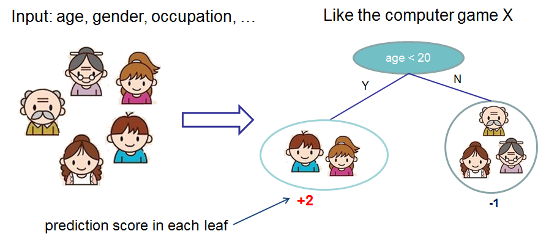
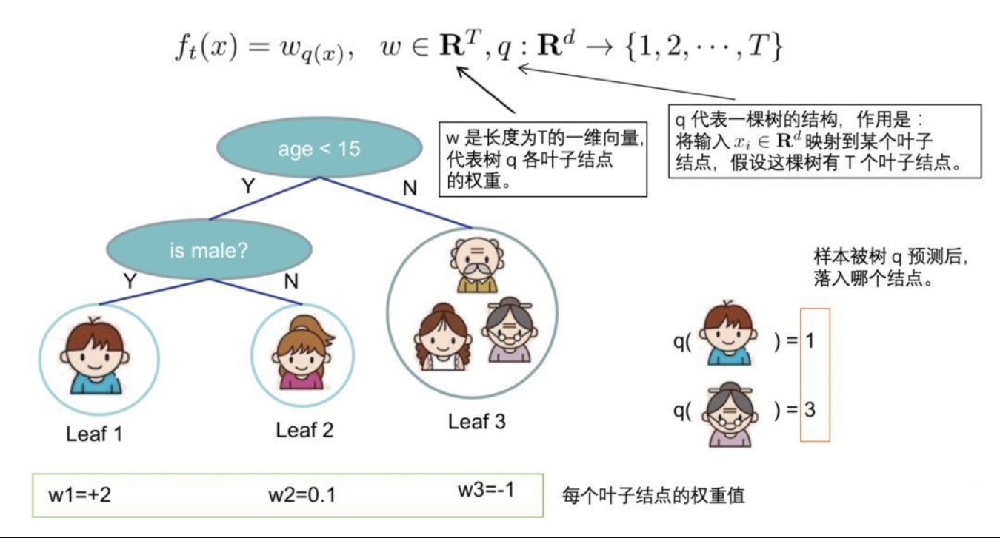
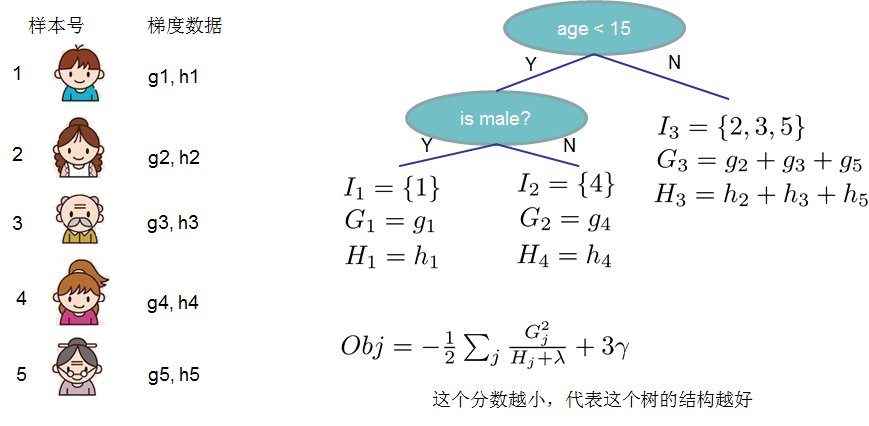

### 1、Xgboost介绍

#### 1.1、Xgboost概述

XGBoost是陈天奇等人开发的一个开源机器学习项目，高效地实现了GBDT算法并进行了算法和工程上的许多改进，被广泛应用在Kaggle竞赛及其他许多机器学习竞赛中并取得了不错的成绩。


#### 1.2、青出于蓝

说到XGBoost，不得不提GBDT(Gradient Boosting Decision Tree)。因为XGBoost本质上还是一个GBDT，但是力争把速度和效率发挥到极致，所以叫X (Extreme) GBoosted。两者都是boosting方法。


### 2、Xgboost树的定义

#### 2.1、构造决策树

先来举个**例子**，我们要预测一家人对电子游戏的喜好程度，考虑到年轻和年老相比，年轻更可能喜欢电子游戏，以及男性和女性相比，男性更喜欢电子游戏，故先根据年龄大小区分小孩和大人，然后再通过性别区分开是男是女，逐一给各人在电子游戏喜好程度上打分，如下图所示。



#### 2.2、决策树集成

就这样，训练出了2棵树tree1和tree2，类似之前gbdt的原理，两棵树的结论累加起来便是最终的结论，所以小孩的预测分数就是两棵树中小孩所落到的结点的分数相加：2 + 0.9 = 2.9。爷爷的预测分数同理：-1 + （-0.9）= -1.9。具体如下图所示：


恩，你可能要拍案而起了，惊呼，这不是跟之前介绍的GBDT乃异曲同工么？

事实上，如果不考虑工程实现、解决问题上的一些差异，XGBoost与GBDT比较大的不同仅仅在于目标函数的定义。


### 3、Xgboost目标函数

#### 3.1、目标函数方程

对于Boosting算法我们知道，是将多个弱分类器的结果结合起来作为最终的结果来进行输出。$f_t(x_i)$​为第 t 棵树的输出结果，$\hat{y}_i^{(t)}$​是模型当前的输出结果，$y_i$​​ 是实际的结果。

那么：

​	$\hat{y}_i^{(t)} = \sum\limits_{t=1}^t f_{t}(x_i)$​

​	$\hat{y}_i^{(t)} = \hat{y}_i^{(t-1)} + f_t(x_i)$

XGBoost的目标函数如下图所示：

$Obj^{(t)} = \sum\limits_{i = 1}^nL(y_i,\hat{y}_i) + \sum\limits_{i =1}^t\Omega(f_t)$​

* 训练损失

  $\sum\limits_{i = 1}^nL(y_i,\hat{y}_i)$​

* 常见损失函数

  

* 树的复杂度

  $\sum\limits_{i =1}^t\Omega(f_i)$​

Xgboost包含多棵树，定义每棵树的复杂度：

​	$\Omega(f) = \gamma T + \frac{1}{2}\lambda \sum\limits_{j=1}^T w_j^2$

​	其中 T 为叶子节点的个数，为叶子节点向量的模 。$\gamma$ 表示节点切分的难度，$\lambda$ 表示L2正则化系数。

$Obj^{(t)} = \sum\limits_{i = 1}^nL(y_i,\hat{y}_i^{(t-1)} + f_t(x_i)) + \sum\limits_{i =1}^t\Omega(f_i)$​​​

$Obj^{(t)} = \sum\limits_{i=1}^nL(y_i,\hat{y}_i^{(t-1)} + f_t{(x_i})) + \Omega(f_t) + \sum\limits_{i=1}^{t-1}\Omega(f_i)$​​

$Obj^{(t)} = \sum\limits_{i=1}^nL(y_i,\hat{y}_i^{(t-1)} + f_t{(x_i})) + \Omega(f_t) + constant$​​

$\sum\limits_{i=1}^{t-1}\Omega(f_i)$​ 为前 t-1 棵树的复杂度，是常数项，求导时可忽略。目标函数简化为：

<font size = 6 color = green>$Obj^{(t)} = \sum\limits_{i=1}^nL\left(y_i,\hat{y}_i^{t-1} + f_t{(x_i})\right) + \Omega(f_t)$​</font>​​


#### 3.2、目标函数泰勒展开

泰勒展开近似目标函数：

$f(x + \Delta x) \approx f(x) + f'(x)\Delta x + \frac{1}{2}f''(x)\Delta x^2$

令：

​	$g_i = \partial_{\hat{y}^{(t-1)}}l(y,\hat{y}^{(t-1)})$​

​	$h_i = \partial^2_{\hat{y}^{(t-1)}}l(y,\hat{y}^{(t-1)})$​

则：

<font size = 6 color = green>$Obj^{t} \approx \sum\limits_{i=1}^n\left[ l(y_i,\hat{y}_i^{(t-1)}) + g_if_t(x_i) + \frac{1}{2}h_if^2_t(x_i)\right] + \Omega(f_t)$​</font>​​

* 方程中的 $$l$$​​ 即为损失函数（比如平方损失函数：$$l(y_i,\hat{y_i}) = (y_i - \hat{y_i})^2$$​​，或者交叉熵Log-loss
* $\Omega(f_t)$​ 的是正则项（包括L1正则、L2正则），防止过拟合，鲁棒性加强。
* 对于 f(x)，XGBoost利用二阶泰勒展开三项，做一个近似。**f(x)表示的是其中一颗回归树。**

由于在第 $t$ 步时  $\hat{y}_i^{(t-1)}$其实是一个已知的值，所以 $l(y_i,\hat{y}_i^{(t-1)})$​ 是一个常数，其对函数的优化不会产生影响。因此，去掉全部的常数项，得到目标函数为：

<font size = 6 color = green>$Obj^{t} \approx \sum\limits_{i=1}^n\left[g_if_t(x_i) + \frac{1}{2}h_if^2_t(x_i)\right] + \Omega(f_t)$​</font>

​		<font size = 5 color = green>$g_i = \partial_{\hat{y}^{(t-1)}}l(y,\hat{y}^{(t-1)})$​​</font>​

​		<font size = 5 color = green>$h_i = \partial^2_{\hat{y}^{(t-1)}}l(y,\hat{y}^{(t-1)})$​​​</font>

所以我们只需要求出每一步损失函数的一阶导和二阶导的值（由于前一步的 $\hat{y}^{(t-1)}$ 是已知的，所以这两个值就是常数），然后最优化目标函数，就可以得到每一步的 $f(x)$ ，最后根据加法模型得到一个整体模型。


#### 3.3、定义一棵树

我们重新定义一颗树，包括两个部分：

- 叶子结点的权重向量 $w$；
- 实例 ---> 叶子结点的映射关系q（本质是树的分支结构）；

一棵树的表达形式定义如下：




#### 3.4、定义树的复杂度

我们定义一颗树的复杂度 $\Omega$，它由两部分组成：

- 叶子结点的数量；
- 叶子结点权重向量的L2范数；


#### 3.5、叶结点归组

我们将属于第 j 个叶子结点的所有样本 xi , 划入到一个叶子结点样本集中，数学表示如下：

​	$I_j = {i|q(x_i) == j}$

然后，将【3】和【4】中一棵树及其复杂度的定义，带入到【2】中泰勒展开后的目标函数 Obj 中，具体推导如下：

$\begin{aligned}Obj^{(t)} &\approx \sum\limits_{i=1}^n\left[g_if_t(x_i) + \frac{1}{2}h_if^2_t(x_i)\right] + \Omega(f_t)\\\\ &= \sum\limits_{i=1}^n\left[g_iw_{q(x_i) }+\frac{1}{2}h_iw^2_{q(x_i)}\right] + \gamma T +\frac{1}{2}\lambda\sum\limits_{j = 1}^Tw_j^2\\\\ &=\sum\limits_{j=1}^T\left[(\sum\limits_{i \in I_j}g_i)w_j + \frac{1}{2}(\sum\limits_{i \in I_j}h_i + \lambda)w_j^2\right] + \gamma T\end{aligned}$​

所有的训练样本，按叶子结点进行了分组！

为了进一步简化上式，我们定义：

​	$G_j = \sum\limits_{i \in I_j}g_i$

​	$H_j = \sum\limits_{i \in I_j}h_i$

含义如下：

* $G_j$ ：叶子结点 j 所包含样本的一阶偏导数累加和，是一个常量
* $H_j$ ：叶子结点 j 所包含样本的二阶偏导数累加和，是一个常量

将 $G_j$ 和 $H_j$ 带入目标式 Obj，得到我们<font color = green>**最终的目标函数**</font>（注意，此时式中的变量只剩下第 t 棵树的权重向量 w）

<font size = 6 color = green>$\begin{aligned}Obj^{(t)} &=\sum\limits_{j=1}^T\left[(\sum\limits_{i \in I_j}g_i)w_j + \frac{1}{2}(\sum\limits_{i \in I_j}h_i + \lambda)w_j^2\right] + \gamma T\\\\&=\sum\limits_{j = 1}^T\left[G_jw_j + \frac{1}{2}(H_j + \lambda)w^2_j\right] + \gamma T\end{aligned}$</font>​​​


#### 3.6、树结构得分

回忆一下高中数学知识。假设有一个一元二次函数，形式如下：

<font size = 6>$Gx + \frac{1}{2}Hx^2, H > 0$​</font>​

我们可以套用一元二次函数的最值公式轻易地求出最值点：

<font size = 6>$x^* = -\frac{b}{2a} = \frac{G}{H}$</font>​

那么回到XGBoost的最终目标函数上 $Obj^{(t)}$​ ，该如何求出它的最值呢？

<font size = 6>$Obj^{(t)} = \sum\limits_{j = 1}^T\left[G_jw_j + \frac{1}{2}(H_j + \lambda)w^2_j\right] + \gamma T$</font>​​

我们先简单分析一下上面的式子：

- 对于每个叶子结点  ，可以将其从目标函数中拆解出来：

<font size = 6>$G_jw_j + \frac{1}{2}(H_j + \lambda)w_j^2$</font>

在【**3.5、叶结点归组**】中我们提到，$G_j$ 和 $H_j$ 相对于第 t 棵树来说是可以计算出来。那么，这个式子就是一个只包含一个变量**叶子结点权重** $w_j$​ 的一元二次函数，我们可以通过最值公式求出它的最值点。也可以参考[一元二次方程求根公式](https://baike.baidu.com/item/%E4%B8%80%E5%85%83%E4%BA%8C%E6%AC%A1%E6%96%B9%E7%A8%8B%E6%B1%82%E6%A0%B9%E5%85%AC%E5%BC%8F/56066624)。


* 两个不同实根：<font size = 6>$x_{1,2} = \frac{-b\ \ \pm\ \  \sqrt{\Delta}}{2a} = \frac{-b \ \ \pm \ \  \sqrt{b^2 - 4ac}}{2a}$​​​​​​​​​​</font>​

* 两个相等实根：<font size = 6>$x_{1,2} = -\frac{b}{2a}$</font>

再次分析一下目标函数 $Obj^{(t)}$​ ，可以发现，各个叶子结点的目标子式是相互独立的，也就是说，当每个叶子结点的子式都达到最值点时，整个目标函数 $Obj^{(t)}$​ 才达到最值点。

那么，假设目前树的结构已经固定，套用一元二次函数的最值公式，将目标函数对 $w_j$ 求一阶导，并令其等于 0 ，则可以求得叶子结点 $j$ 对应的权值：

<font size = 6>$w^*_j = -\frac{G_j}{H_j + \lambda}$</font>

所以目标函数可以化简为：

<font size = 6 color = green>$\begin{aligned}Obj^{(t)} &= \sum\limits_{j = 1}^T\left[G_jw_j + \frac{1}{2}(H_j + \lambda)w^2_j\right] + \gamma T\\\\&=\sum\limits_{j = 1}^T\left[-\frac{G_j^2}{H_j + \lambda} +\frac{1}{2}\frac{G_j^2}{H_j + \lambda} \right] + \gamma T\\\\&=-\frac{1}{2}\sum\limits_{j = 1}^T\frac{G_j^2}{H_j + \lambda} + \gamma T\end{aligned}$​</font>



上图给出目标函数计算的例子，求每个节点每个样本的一阶导数 $g_j$ 和二阶导数 $h_j$ ，然后针对每个节点对所含样本求和得到 $G_j$ 和 $H_j$​ ，最后遍历决策树的节点即可得到目标函数。


#### 3.7、[XGBoost与GBDT差异](https://blog.csdn.net/Soft_Po/article/details/120416103)


### 4、Xgboost模型使用

#### 4.1、模型基本使用

[参数说明](https://blog.csdn.net/Soft_Po/article/details/120372703)

##### 4.1.1、使用方式一

```Python
import numpy as np
import xgboost as xgb
from xgboost import XGBClassifier
from sklearn import datasets
from sklearn import tree
from sklearn.model_selection import train_test_split
X,y = datasets.load_wine(return_X_y=True)
X_train,X_test,y_train,y_test = train_test_split(X,y,test_size=0.2)
model = XGBClassifier(learning_rate =0.1,# 学习率，控制每次迭代更新权重时的步长，默认0.3。值越小，训练越慢。
                      n_estimators=10,# 总共迭代的次数，即决策树的个数
                      max_depth=5, # 深度
                      min_child_weight= 1,# 默认值为1,。值越大，越容易欠拟合；值越小，越容易过拟合
                      gamma=0.3,# 惩罚项系数，指定节点分裂所需的最小损失函数下降值。
                      subsample=0.8,# 训练每棵树时，使用的数据占全部训练集的比例。默认值为1，典型值为0.5-1。防止overfitting。
                      colsample_bytree=0.8,
                      objective= 'binary:logistic',# 目标函数
                      eval_metric = ['merror'],# 验证数据集评判标准
                      nthread=4,)# 并行线程数
eval_set = [(X_test, y_test),(X_train,y_train)]
model.fit(X_train,y_train,eval_set = eval_set,verbose = True)
model.score(X_test,y_test)
```

XGBoost可视化

```Python
xgb.to_graphviz(model,
                condition_node_params={'shape': 'box',
                                       'style': 'filled,rounded',
                                       'fillcolor': '#78bceb'},
                leaf_node_params={'shape': 'box',
                                  'style': 'filled,rounded',
                                  'fillcolor': '#e48038'})
```


##### 4.1.2、使用方式二

```Python
X,y = datasets.load_wine(return_X_y=True)
X_train,X_test,y_train,y_test = train_test_split(X,y,test_size=0.2)
param = {'learning_rate':0.1,
         'n_estimators':10000,
         'max_depth':5,
         'min_child_weight':1,
         'gamma':0.3,
         'subsample':0.8,
         'colsample_bytree':0.8, 
         'verbosity':0,
         'objective':'multi:softprob',
         'eval_metric':'merror',
         'early_stopping_rounds':20}

model = xgb.XGBClassifier(**param)
model.fit(X_train, y_train,eval_set=[(X_test, y_test)])
model.score(X_test,y_test)
```

##### 4.1.3、使用方式三

DMatrix是XGBoost中使用的数据矩阵。DMatrix是XGBoost使用的内部数据结构，它针对内存效率和训练速度进行了优化

```Python
import xgboost as xgb
from sklearn.metrics import accuracy_score
from sklearn import datasets
X,y = datasets.load_wine(return_X_y=True)
X_train,X_test,y_train,y_test = train_test_split(X,y,test_size=0.2)

# 创建数据
dtrain = xgb.DMatrix(data = X_train,label = y_train)
dtest = xgb.DMatrix(data = X_test,label = y_test)

# 指定参数
param = {'learning_rate':0.1,
         'max_depth':5,
         'min_child_weight':1,
         'gamma':0.3,
         'subsample':0.8,
         'eval_metric':['merror','mlogloss'],
         'colsample_bytree':0.1, 
         'verbosity':0,
         'objective':'multi:softmax',
         'num_class':3}
num_round = 1000
evals = [(dtrain,'train'),(dtest,'eval')]
bst = xgb.train(param,
                dtrain,
                num_round,
                evals = evals,
                early_stopping_rounds=10)
# 进行预测
y_ = bst.predict(dtest)
display(y_,accuracy_score(y_test,y_))
```
